# Flow đếm ngược, phát nhạc và notification

Tài liệu này mô tả các luồng:

1. Chọn và nghe thử nhạc của Timer.
2. Timer đếm ngược và phát nhạc khi hết giờ.
3. Notification dự phòng khi Timer kết thúc.
4. Chọn và nghe thử nhạc của Alarm.
5. Notification trước Alarm một phút.
6. Notification toàn màn hình khi Alarm reo.

---

## 1. Tổng quan các thành phần

| Thành phần | Vai trò |
|---|---|
| `TimerFragment` | Chọn thời gian, đếm ngược, nghe thử và phát nhạc Timer |
| `TimerScheduler` | Đặt hoặc hủy lịch notification dự phòng cho Timer |
| `TimerReceiver` | Nhận lịch Timer và hiện notification `Time is up` |
| `AlarmEditorActivity` | Thêm/sửa Alarm, chọn và nghe thử nhạc chuông |
| `SavedMusicDao` | Lưu/đọc thư viện URI dùng chung trong `alarm.db` |
| `AlarmScheduler` | Tính thời điểm Alarm, đặt lịch Alarm chính và lịch trước một phút |
| `UpcomingAlarmReceiver` | Hiện notification `Alarm in 1 minute` |
| `AlarmReceiver` | Nhận sự kiện Alarm tới giờ và khởi động `AlarmService` |
| `AlarmService` | Phát nhạc, rung và tạo foreground/full-screen notification |
| `MusicHelper` | Quản lý `MediaPlayer` của Alarm |
| `AlarmActivity` | Màn hình Snooze/Dismiss khi Alarm đang reo |

---

# 2. Chọn và nghe thử nhạc của Timer

## 2.1. Sơ đồ

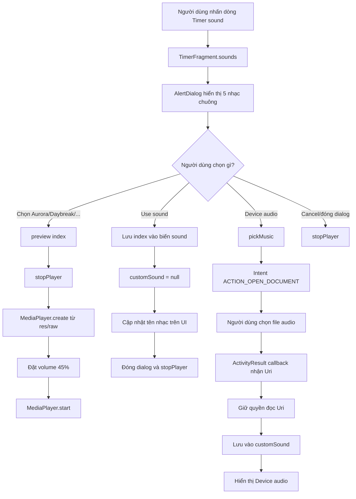

## 2.2. Flow file và phương thức

```text
TimerFragment
    -> row_timer_melody.setOnClickListener()
        -> sounds()
            -> AlertDialog.setSingleChoiceItems()
                -> preview(index)
                    -> stopPlayer()
                    -> MediaPlayer.create()
                    -> setVolume(0.45f, 0.45f)
                    -> start()
```

`preview(index)` chỉ nghe thử một trong năm file có sẵn:

```text
index 0 -> R.raw.alarm1
index 1 -> R.raw.alarm2
index 2 -> R.raw.alarm3
index 3 -> R.raw.alarm4
index 4 -> R.raw.alarm5
```

Khi người dùng nhấn `Use sound`:

```java
sound = choice[0];
customSound = null;
```

- `sound` giữ index nhạc mặc định.
- `customSound = null` để Timer biết không sử dụng file từ thiết bị.

Khi chọn `Device audio`:

```text
TimerFragment.pickMusic()
    -> Intent.ACTION_OPEN_DOCUMENT
    -> MIME type audio/*
    -> Activity Result API
    -> customSound = Uri người dùng chọn
```

Các flag:

```java
Intent.FLAG_GRANT_READ_URI_PERMISSION
Intent.FLAG_GRANT_PERSISTABLE_URI_PERMISSION
```

cho phép app đọc file và xin giữ quyền đọc lâu dài.

> Source hiện tại nghe thử tự động đối với năm nhạc `res/raw`. Khi chọn file từ thiết bị, app lưu URI và tên hiển thị nhưng không tự phát thử file URI ngay tại callback.

---

# 3. Timer đếm ngược và phát nhạc khi hết giờ

## 3.1. Sơ đồ chính

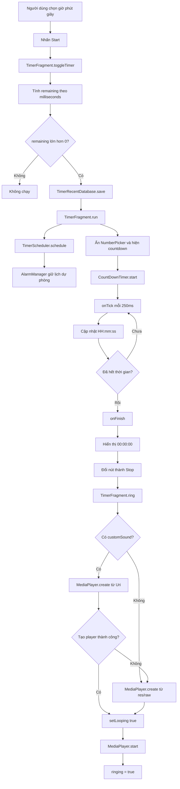

## 3.2. Đổi giờ, phút, giây thành milliseconds

Trong `TimerFragment.toggleTimer()`:

```java
remaining = (
    hours.getValue() * 3600L
    + minutes.getValue() * 60L
    + seconds.getValue()
) * 1000L;
```

Ví dụ `01:02:03`:

```text
1 giờ   = 1 × 3600 = 3600 giây
2 phút  = 2 × 60   = 120 giây
3 giây  = 3 giây
Tổng    = 3723 giây
remaining = 3.723.000 milliseconds
```

## 3.3. Hai luồng chạy song song

`TimerFragment.run()` tạo hai cơ chế:

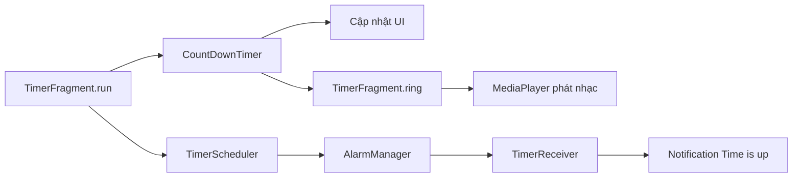

| Cơ chế | Chức năng |
|---|---|
| `CountDownTimer` | Cập nhật số đếm ngược và gọi `ring()` khi Fragment còn hoạt động |
| `TimerScheduler` | Tạo notification dự phòng thông qua hệ thống |

## 3.4. `onTick()` cập nhật giao diện

```text
Giờ   = remaining / 3.600.000
Phút  = remaining / 60.000, sau đó % 60
Giây  = remaining / 1.000, sau đó % 60
```

Kết quả được format thành:

```text
HH:mm:ss
```

## 3.5. `ring()` chọn nguồn nhạc

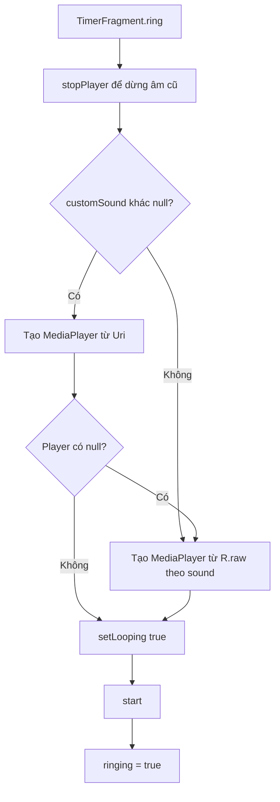

Nếu file thiết bị không còn đọc được, code fallback về nhạc có sẵn.

## 3.6. Pause, Resume, Stop và Cancel

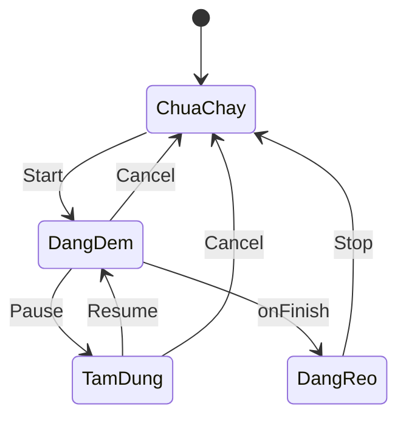

Pause:

```text
CountDownTimer.cancel()
-> giữ nguyên remaining
-> TimerScheduler.cancel()
-> nút đổi thành Resume
```

Resume:

```text
remaining vẫn lớn hơn 0
-> gọi run() lại
-> tạo CountDownTimer và lịch dự phòng mới
```

Stop/Cancel:

```text
TimerFragment.cancelTimer()
-> hủy CountDownTimer
-> remaining = 0
-> TimerScheduler.cancel()
-> stopPlayer()
-> hiện lại NumberPicker
```

---

# 4. Notification khi Timer kết thúc

## 4.1. Sơ đồ

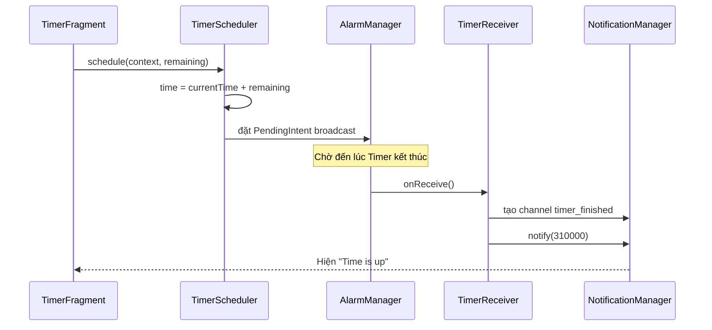

`TimerScheduler` dùng request code cố định:

```java
310000
```

`TimerReceiver` tạo notification:

```text
Tiêu đề: Time is up
Nội dung: Your timer has finished
Channel: timer_finished
Priority: HIGH
```

> `TimerReceiver` hiện tại chỉ tạo notification. Nó không gọi `MediaPlayer`, không mở lại Timer và không chạy `TimerFragment.ring()`.

---

# 5. Chọn và nghe thử nhạc của Alarm

## 5.1. Sơ đồ

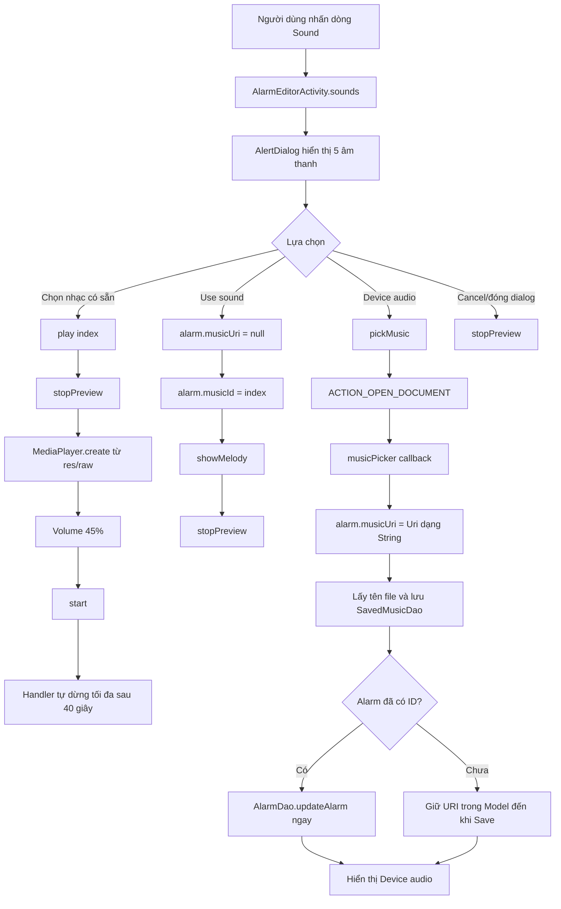

Khác với Timer, lựa chọn của Alarm được giữ trong Model `Alarm`:

```text
Nhạc có sẵn -> musicId
File thiết bị -> musicUri
Ngẫu nhiên   -> randomMusic
Lặp          -> loop
Âm lượng     -> volume
Rung         -> vibrate
```

URI còn được lưu trong bảng dùng chung:

```text
alarm.db
└── saved_music
    ├── _id
    ├── name
    ├── uri UNIQUE
    └── added_at
```

Lần sau khi mở hộp thoại của Alarm khác:

```text
5 nhạc res/raw
+ SavedMusicDao.getAll()
→ một danh sách chung để nghe thử và lựa chọn
```

Khi nhấn một bài URI đã lưu, app kiểm tra file trước:

```text
AlarmEditorActivity.sounds()
-> MusicUriHelper.isReadable(uri)
-> nếu không đọc được:
   -> Toast báo không tìm thấy bài
   -> xóa bài khỏi saved_music
   -> đặt musicUri = null, musicId = 0 cho mọi Alarm đang dùng bài đó
```

Nếu đang sửa alarm đã tồn tại, URI nhạc thiết bị được update vào SQLite ngay tại callback. Với alarm mới chưa có ID, URI được giữ trong Model và insert khi nhấn Save để không tạo alarm rác nếu người dùng đóng màn hình.

Luồng lưu thông thường:

```text
AlarmEditorActivity
-> AlarmDao
-> AlarmDatabaseHelper
-> SQLite
```

Khi Alarm thực sự reo, `AlarmService` đọc các giá trị này để chọn cách phát.

---

# 6. Notification trước Alarm một phút

## 6.1. Sơ đồ

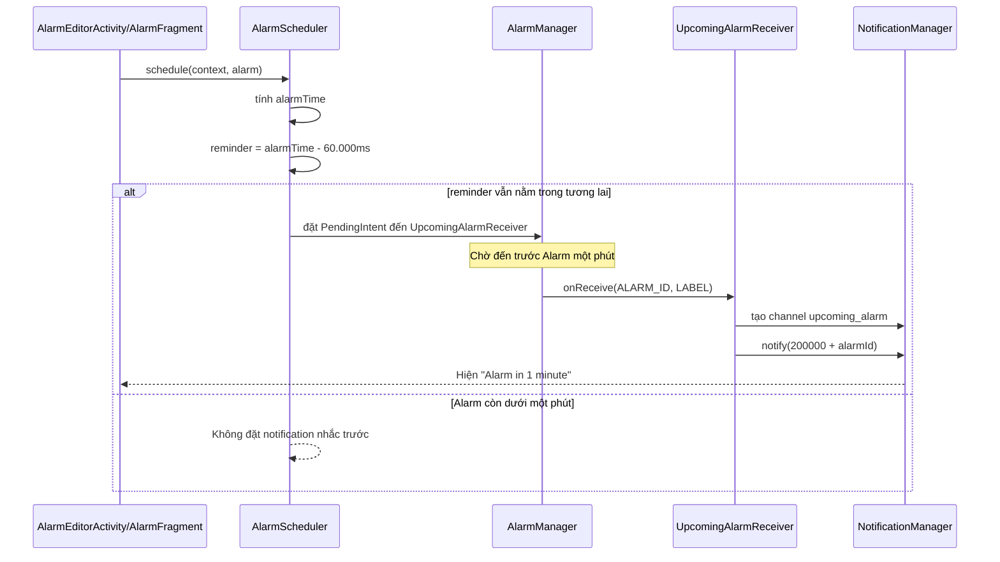

Thời điểm notification:

```java
long reminder = alarmTime - 60_000L;
```

Request code:

```java
200000 + alarm.getId()
```

Nội dung:

```text
Tiêu đề: Alarm in 1 minute
Nội dung: label của Alarm
Fallback: Your alarm is about to ring
Channel: upcoming_alarm
```

Notification trước một phút chỉ nhắc người dùng. Nó không phát chuông Alarm và không khởi động `AlarmService`.

Khi Alarm chính bắt đầu reo:

```text
AlarmReceiver.onReceive()
-> NotificationManager.cancel(200000 + alarmId)
-> notification "Alarm in 1 minute" biến mất khỏi thanh thông báo
-> khởi động AlarmService
```

---

# 7. Notification và phát nhạc khi Alarm reo

## 7.1. Sơ đồ đầy đủ

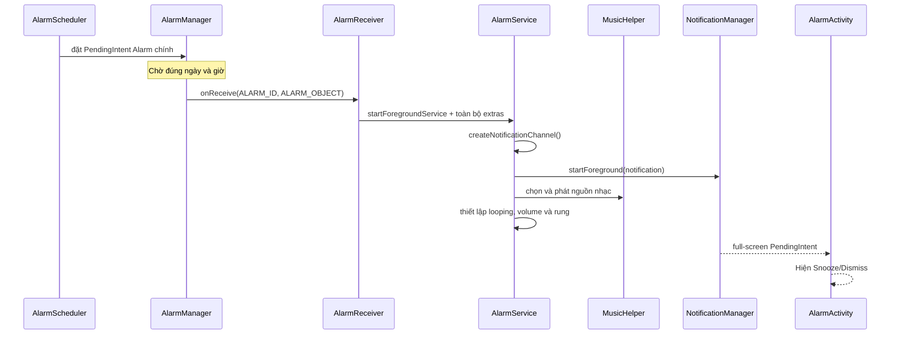

## 7.2. Chọn nhạc trong `AlarmService`

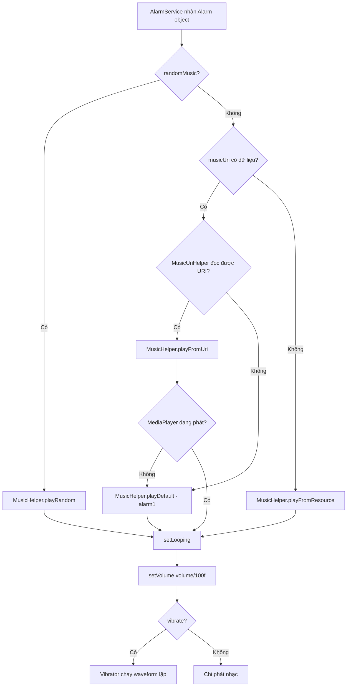

Thứ tự ưu tiên nguồn âm thanh:

```text
1. Random music
2. File audio từ thiết bị
3. Bài res/raw đã chọn bằng musicId
4. Nếu URI bị mất hoặc không phát được: cố định R.raw.alarm1
```

## 7.3. Tạo notification toàn màn hình

`AlarmService` tạo Intent đến `AlarmActivity`:

```text
AlarmService
-> Intent(AlarmActivity)
-> putExtra(ALARM_OBJECT)
-> PendingIntent.getActivity()
-> Notification.setContentIntent()
-> Notification.setDeleteIntent()
-> Notification.setFullScreenIntent()
-> Notification.setOngoing(true)
```

Flow:

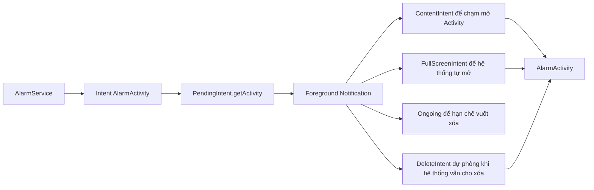

Điểm cần trình bày chính xác:

- `AlarmService` không gọi trực tiếp `startActivity()`.
- Service gắn một full-screen `PendingIntent` vào notification.
- Android quyết định mở `AlarmActivity` toàn màn hình hoặc hiện heads-up notification tùy quyền và trạng thái hệ thống.
- Nếu Activity không tự mở, chạm notification sẽ mở `AlarmActivity` qua `contentIntent`.
- Notification là ongoing và không auto-cancel, nên không thể vuốt xóa theo hành vi thông thường khi chuông còn reo.
- Android 14+ vẫn có thể cho phép xóa một số ongoing notification; `deleteIntent` sẽ mở `AlarmActivity` nếu trường hợp đó xảy ra.

## 7.4. Dismiss và Snooze

Dismiss:

```text
AlarmActivity.dismiss()
-> stopService(AlarmService)
-> AlarmService.onDestroy()
-> MusicHelper.stop()
-> Vibrator.cancel()
-> finish AlarmActivity
```

Snooze:

```text
AlarmActivity.snooze()
-> AlarmScheduler.snooze()
-> AlarmManager đặt lịch sau 5 phút
-> AlarmActivity.dismiss()
-> dừng Service hiện tại

Sau 5 phút:
AlarmManager
-> AlarmReceiver
-> AlarmService
-> phát nhạc và notification lại
```

---

# 8. So sánh ba loại notification

| Loại | File đặt lịch | File nhận | Nội dung | Có phát nhạc? | Có mở Activity? |
|---|---|---|---|---|---|
| Trước Alarm 1 phút | `AlarmScheduler` | `UpcomingAlarmReceiver` | `Alarm in 1 minute` | Không | Không |
| Alarm đang reo | `AlarmScheduler` | `AlarmReceiver` → `AlarmService` | `Alarm Ringing`, ongoing | Có, qua `MusicHelper` | Tự mở bằng full-screen intent hoặc chạm để mở bằng content intent |
| Timer kết thúc | `TimerScheduler` | `TimerReceiver` | `Time is up` | Receiver không phát; `TimerFragment.ring()` phát nếu Fragment còn chạy | Không |

Sơ đồ tổng hợp:

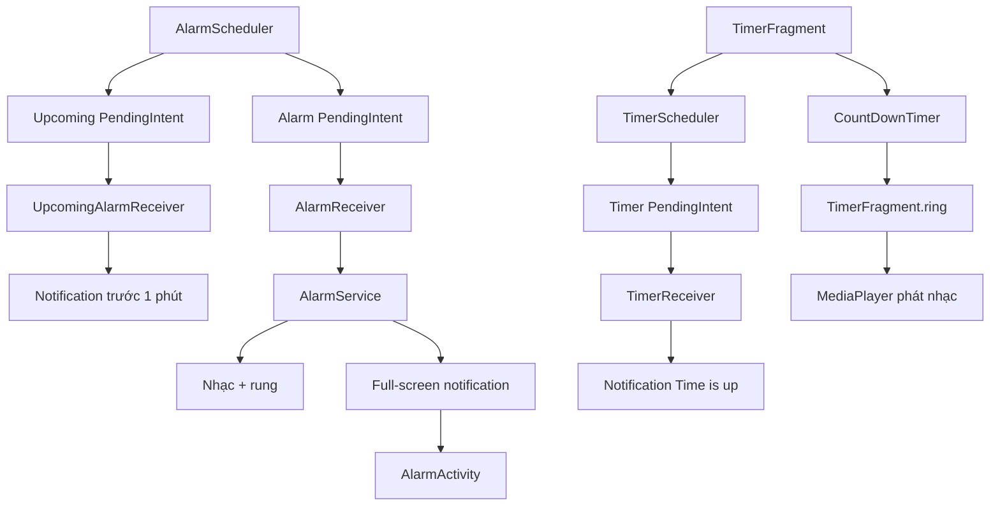

---

# 9. Câu trả lời ngắn khi thuyết trình

> “Timer sử dụng hai luồng song song. `CountDownTimer` cập nhật giao diện và gọi `TimerFragment.ring()` để phát nhạc bằng `MediaPlayer`; `TimerScheduler` dùng `AlarmManager` gọi `TimerReceiver` để hiện notification dự phòng. Alarm thì khác: `AlarmScheduler` gọi `AlarmReceiver`, Receiver khởi động `AlarmService`, Service dùng `MusicHelper` phát nhạc/rung và tạo full-screen notification để Android mở `AlarmActivity`. Ngoài ra, AlarmScheduler còn đặt một PendingIntent riêng cho `UpcomingAlarmReceiver` để thông báo trước một phút.”
