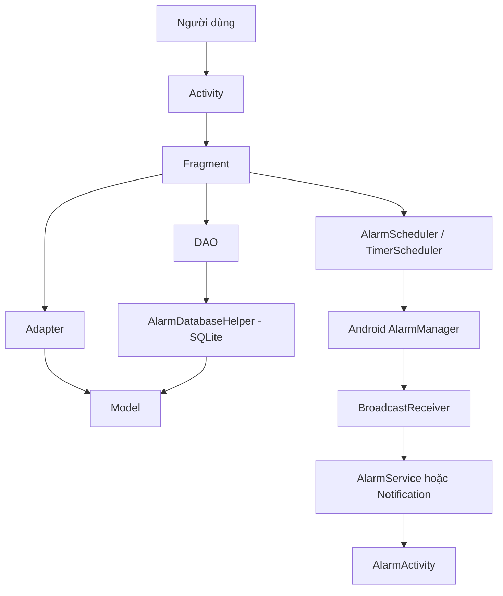
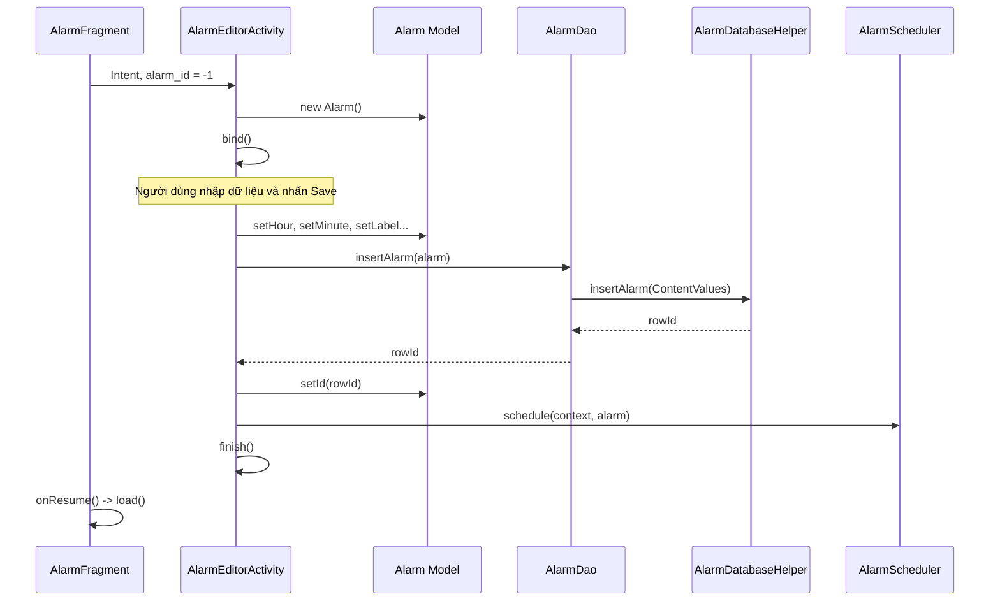
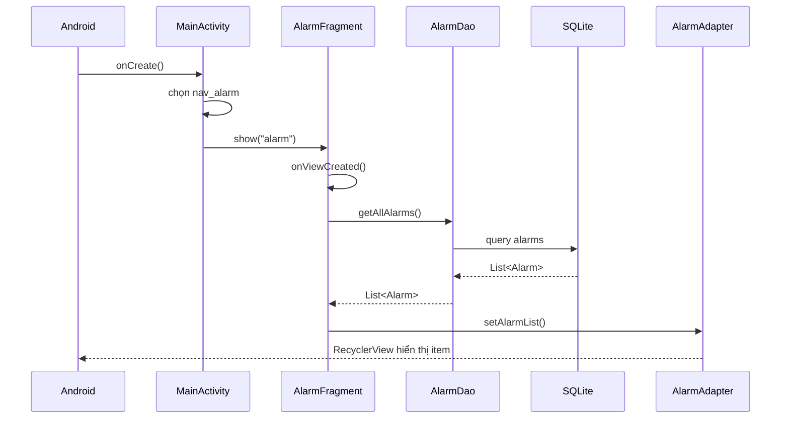
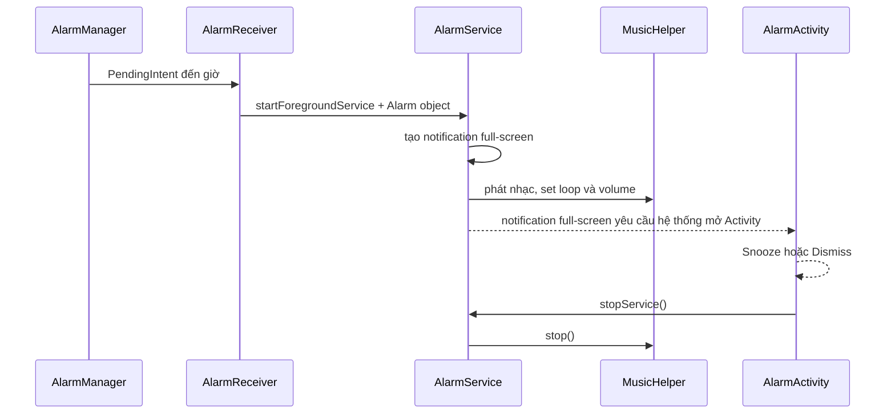
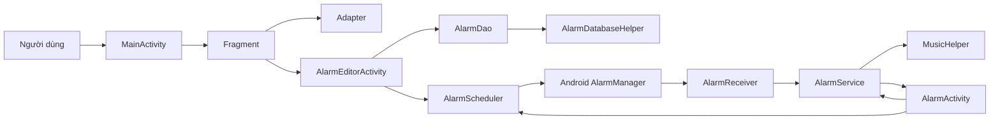

# Tài liệu thuyết trình: Luồng chạy ứng dụng Alarm

> Phạm vi tài liệu: `Activities`, `Fragment`, `Adapter`, `DAO`, `Model`, `Database`, `Util`, `Receiver`, `Service`.
>
> Tài liệu được viết theo source hiện tại trong workspace.
>
> Lưu ý quan trọng: project dùng **SQLite thuần thông qua `SQLiteOpenHelper`**, không dùng Room Database.

---

## 1. Bức tranh tổng thể

### 1.1. Vai trò của từng folder

| Folder | Vai trò | Ví dụ trong project |
|---|---|---|
| `Activities` | Đại diện cho các màn hình độc lập và điều phối cấp cao | Màn chính, màn thêm/sửa alarm, màn alarm đang reo |
| `Fragment` | Đại diện cho 4 tab chức năng nằm trong màn chính | Alarm, World Clock, Timer, Stopwatch |
| `Adapter` | Chuyển dữ liệu Model thành từng item trong `RecyclerView`, đồng thời trả sự kiện click về Fragment | Danh sách alarm, thành phố, timer gần đây |
| `DAO` | Lớp trung gian giữa giao diện và SQLite | CRUD alarm và thư viện nhạc URI |
| `Model` | Đối tượng dữ liệu được truyền giữa các lớp | `Alarm`, `SavedMusic`, `RecentTimer`, `WorldClock` |
| `Database` | Tạo schema và thực thi CRUD trên SQLite | `AlarmDatabaseHelper`, `TimerRecentDatabase` |
| `Util` | Chứa logic hỗ trợ dùng lại ở nhiều luồng | Đặt/hủy lịch, snooze, phát nhạc, style NumberPicker |
| `Receiver` | Nhận broadcast từ `AlarmManager` khi đến thời điểm | Alarm chính, nhắc trước một phút, Timer kết thúc |
| `Service` | Chạy tác vụ báo thức kéo dài ở foreground | Phát nhạc, rung và tạo notification toàn màn hình |

### 1.2. Quan hệ giữa các tầng



Có thể diễn giải ngắn gọn khi thuyết trình:

1. Activity tạo màn hình và chứa Fragment.
2. Fragment xử lý logic giao diện của từng tab.
3. Adapter hiển thị danh sách Model lên RecyclerView.
4. DAO nhận Model từ Fragment và chuyển thành dữ liệu SQLite.
5. Scheduler giao lịch báo thức cho hệ điều hành Android.
6. Khi đến giờ, Receiver nhận sự kiện và khởi động Service/màn báo thức.

---

# 2. Folder `Activities`

## 2.1. `MainActivity`

### Vai trò

`MainActivity` là Activity khởi động đầu tiên của ứng dụng. Nó:

- Nạp layout chính.
- Quản lý bottom navigation.
- Tạo và chuyển đổi giữa 4 Fragment.
- Xin quyền thông báo và quyền đặt exact alarm.
- Dùng chiến lược `show/hide` để Timer và Stopwatch không bị tạo lại khi đổi tab.

### Bảng các hàm

| Hàm | Được gọi khi nào | Chức năng chi tiết | Gọi sang đâu |
|---|---|---|---|
| `onCreate(Bundle savedInstanceState)` | Android tạo `MainActivity` | Nạp `activity_main`, lấy `BottomNavigationView`, đăng ký listener chọn tab, mặc định chọn tab Alarm và gọi hàm xin quyền | Gọi `show(tag)` và `requestAlarmPermissions()` |
| `requestAlarmPermissions()` | Cuối `onCreate()` | Trên Android 13+, xin quyền `POST_NOTIFICATIONS`. Trên Android 12+, kiểm tra quyền `SCHEDULE_EXACT_ALARM`; nếu chưa có thì mở màn cài đặt hệ thống | Gọi Android `requestPermissions()`, `AlarmManager.canScheduleExactAlarms()` và `startActivity(Settings.ACTION_REQUEST_SCHEDULE_EXACT_ALARM)` |
| `show(String tag)` | Khi người dùng chọn item ở bottom navigation | Ẩn các Fragment khác; tìm Fragment theo tag; nếu chưa tồn tại thì tạo; sau đó hiển thị Fragment được chọn | Tạo `AlarmFragment`, `WorldClockFragment`, `TimerFragment` hoặc `StopwatchFragment`; dùng `FragmentManager` |

### Luồng chạy của file

```text
AndroidManifest
    -> khởi động MainActivity
        -> onCreate()
            -> setContentView(activity_main)
            -> đăng ký sự kiện bottom navigation
            -> chọn nav_alarm mặc định
                -> listener gọi show("alarm")
                    -> tạo AlarmFragment nếu chưa có
                    -> add vào fragment_container
                    -> show Fragment
            -> requestAlarmPermissions()
```

### Vì sao dùng `show/hide` thay vì `replace`?

Nếu dùng `replace`, Fragment cũ có thể bị hủy view hoặc tạo lại. Timer/Stopwatch đang chạy có thể mất trạng thái. Source hiện tại giữ các Fragment sống bằng cách:

- `hide()` Fragment không được chọn.
- `show()` Fragment được chọn.
- Chỉ `add()` một lần khi Fragment chưa tồn tại.

Đây là lý do `WorldClockFragment` phải dùng thêm `onHiddenChanged()` để biết tab đã bị ẩn hay hiện.

---

## 2.2. `AlarmEditorActivity`

### Vai trò

Đây là màn hình độc lập để:

- Thêm alarm mới.
- Chỉnh sửa alarm có sẵn.
- Xóa alarm.
- Chọn giờ, phút, ngày lặp.
- Chọn nhạc chuông, âm lượng, rung, lặp nhạc.
- Chọn chế độ tắt alarm thường hoặc giải toán.

Fragment Alarm mở Activity này bằng `Intent` và truyền `alarm_id`.

### Biến quan trọng

| Biến | Ý nghĩa |
|---|---|
| `EXTRA_ALARM_ID` | Key dùng để truyền ID alarm qua Intent |
| `id` | ID alarm đang sửa; `-1` nghĩa là tạo alarm mới |
| `alarm` | Model chứa toàn bộ dữ liệu alarm đang chỉnh |
| `dao` | Đối tượng `AlarmDao` để đọc/ghi SQLite |
| `hour`, `minute` | Hai `NumberPicker` chọn thời gian |
| `days` | Mảng 7 checkbox từ thứ Hai đến Chủ nhật |
| `volume` | Thanh âm lượng |
| `random`, `loop`, `vibrate` | Các tùy chọn dạng switch |
| `challenge` | Spinner chọn cách tắt alarm |
| `preview` | `MediaPlayer` dùng nghe thử âm thanh |
| `previewHandler`, `stopPreview` | Dừng preview sau thời gian giới hạn |
| `musicPicker` | Activity Result Launcher nhận file nhạc người dùng chọn |

### Bảng các hàm và callback

| Hàm/callback | Chức năng chi tiết | Hàm/lớp được gọi |
|---|---|---|
| Callback `musicPicker` | Nhận URI, lấy tên file, giữ quyền đọc, lưu vào thư viện `saved_music`, gán cho Alarm; nếu đang edit thì update dòng Alarm ngay | `SavedMusicDao.save()`, `Alarm.setMusicUri()`, `AlarmDao.updateAlarm()` |
| `onCreate(Bundle state)` | Nạp layout, lấy `alarm_id`, tạo DAO, ánh xạ toàn bộ View, cấu hình NumberPicker, tạo hoặc đọc Model Alarm, bind dữ liệu và gắn listener cho Close/Save/Delete/Sound | `AlarmDao.getAlarmbyId()`, `bind()`, `NumberPickerStyler.apply()`, `save()`, `delete()`, `sounds()` |
| `bind()` | Đưa dữ liệu từ Model `alarm` lên giao diện. Nếu là edit thì hiện nút Delete và đổi title. Tick các ngày lặp dựa trên `repeatDays` | Gọi các getter của `Alarm` và `showMelody()` |
| `sounds()` | Ghép 5 nhạc mặc định với toàn bộ `SavedMusic`; click để preview, chọn lại URI đã lưu hoặc thêm file mới | `SavedMusicDao.getAll()`, `play()`, `pickMusic()` |
| `showMelody()` | Hiển thị tên nhạc mặc định hoặc tên file tương ứng với `musicUri` trong thư viện | `SavedMusicDao.getAll()` |
| `pickMusic()` | Tạo `Intent.ACTION_OPEN_DOCUMENT` với MIME `audio/*`, cho phép chọn một file âm thanh và giữ quyền đọc | Gọi `musicPicker.launch(intent)` |
| `play(int index)` | Dừng preview cũ, tạo `MediaPlayer` từ một trong 5 file `R.raw.alarm1..5`, giảm volume preview, phát và lên lịch tự dừng | Android `MediaPlayer`; `previewHandler.postDelayed()` |
| `stopPreview()` | Xóa callback tự dừng, stop/release MediaPlayer và đặt `preview = null` | Android `MediaPlayer.stop()` và `release()` |
| `save()` | Đọc toàn bộ giá trị UI vào Model. Ghép ngày lặp thành chuỗi số. Insert nếu ID < 0, update nếu đang sửa. Sau đó đặt lịch hệ thống, trả kết quả OK và đóng Activity | `AlarmDao.insertAlarm()`, `AlarmDao.updateAlarm()`, `AlarmScheduler.schedule()`, `finish()` |
| `delete()` | Hủy lịch Android, xóa alarm trong SQLite, trả kết quả OK và đóng màn hình | `AlarmScheduler.cancel()`, `AlarmDao.deleteAlarm()`, `finish()` |
| `onDestroy()` | Đảm bảo âm thanh nghe thử được dừng khi Activity bị hủy | Gọi `stopPreview()` |

### Luồng thêm alarm



### Luồng sửa alarm

```text
Click item Alarm
    -> AlarmAdapter callback
    -> AlarmFragment.edit(id)
    -> mở AlarmEditorActivity với alarm_id
    -> AlarmDao.getAlarmbyId(id)
    -> bind dữ liệu lên UI
    -> người dùng sửa và Save
    -> AlarmDao.updateAlarm(alarm)
    -> AlarmScheduler.schedule() cập nhật PendingIntent cùng ID
    -> finish()
    -> AlarmFragment.onResume()
    -> load lại danh sách
```

### Chuỗi `repeatDays`

Source lưu ngày lặp dưới dạng chuỗi chứa các chữ số:

| Chỉ số | Ngày |
|---|---|
| `0` | Thứ Hai |
| `1` | Thứ Ba |
| `2` | Thứ Tư |
| `3` | Thứ Năm |
| `4` | Thứ Sáu |
| `5` | Thứ Bảy |
| `6` | Chủ nhật |

Ví dụ chọn thứ Hai, thứ Tư, thứ Sáu thì code hiện tại tạo chuỗi `"024"`.

Lưu ý: comment trong Model ghi dạng `"0,1,2..."`, nhưng code `save()` thực tế nối số không có dấu phẩy.

---

## 2.3. `AlarmActivity`

### Vai trò

Đây là màn hình xuất hiện khi alarm đang reo. Activity:

- Hiển thị thời gian hiện tại và label.
- Có nút Snooze 5 phút.
- Có nút Dismiss.
- Nếu `dismissMode == 1`, bắt người dùng giải toán trước khi tắt.
- Chặn nút/gesture Back để không thoát màn báo thức ngoài ý muốn.

### Bảng các hàm

| Hàm/callback | Chức năng | Gọi sang đâu |
|---|---|---|
| `onCreate(Bundle state)` | Nhận `Alarm` từ Intent bằng key `ALARM_OBJECT`, hiển thị label, xác định có cần bài toán hay không, chặn Back, gắn sự kiện Snooze và Dismiss | `generateMathProblem()`, `snooze()`, `dismiss()` |
| `OnBackPressedCallback.handleOnBackPressed()` | Không làm gì, mục đích là chặn back gesture theo API AndroidX mới | AndroidX `OnBackPressedDispatcher` |
| Callback nút Dismiss | Nếu không có thử thách thì tắt ngay. Nếu có thì parse đáp án, so với `mathResult`; đúng thì dismiss, sai thì báo lỗi và sinh phép toán mới | `Toast`, `generateMathProblem()`, `dismiss()` |
| `generateMathProblem()` | Sinh hai số ngẫu nhiên từ 10 đến 49, lưu tổng vào `mathResult`, hiển thị câu hỏi | Java `Random` |
| `snooze()` | Nếu Model alarm tồn tại thì đặt một alarm phụ sau 5 phút, sau đó tắt Service hiện tại | `AlarmScheduler.snooze()`, rồi `dismiss()` |
| `dismiss()` | Dừng `AlarmService` để tắt nhạc/rung và đóng Activity | Android `stopService()`, `finish()` |
| `onBackPressed()` | Cách chặn nút Back kiểu cũ, giữ lại để tương thích; thân hàm rỗng | Không gọi lớp khác |

### Luồng khi người dùng bấm Snooze

```text
AlarmActivity.snooze()
    -> AlarmScheduler.snooze(context, alarm)
        -> AlarmManager đặt PendingIntent sau 5 phút
        -> PendingIntent nhắm đến AlarmReceiver
        -> Intent có SNOOZE = true
    -> AlarmActivity.dismiss()
        -> stopService(AlarmService)
        -> AlarmService.onDestroy()
            -> dừng nhạc
            -> dừng rung
        -> finish()
```

---

# 3. Folder `Fragment`

## 3.1. `AlarmFragment`

### Vai trò

Fragment này là tab quản lý alarm:

- Đọc tất cả alarm từ DAO.
- Hiển thị danh sách qua `AlarmAdapter`.
- Hiển thị alarm gần nhất.
- Mở Activity thêm/sửa.
- Bật/tắt alarm.

### Bảng các hàm

| Hàm | Chức năng | Gọi sang đâu |
|---|---|---|
| `AlarmFragment()` | Constructor chỉ định sẵn layout `fragment_alarm` | Constructor `Fragment(int contentLayoutId)` |
| `onViewCreated(View view, Bundle state)` | Tạo DAO và Adapter; callback click item gọi `edit(id)`; callback switch gọi `setEnabled(alarm)`; cấu hình RecyclerView; gắn nút Add; tải dữ liệu | `AlarmDao`, `AlarmAdapter`, `LinearLayoutManager`, `load()` |
| `onResume()` | Khi quay lại từ `AlarmEditorActivity`, tải lại danh sách để phản ánh thêm/sửa/xóa | `load()` |
| `load()` | Lấy alarm từ SQLite, đưa sang Adapter, duyệt alarm enabled để tìm alarm có thời điểm gần nhất và cập nhật card Next Alarm | `AlarmDao.getAllAlarms()`, `AlarmAdapter.setAlarmList()`, Java `Calendar` |
| `edit(int id)` | Mở `AlarmEditorActivity` và truyền ID. `-1` nghĩa là thêm mới | Android `Intent`, `startActivity()` |
| `setEnabled(Alarm alarm)` | Update trạng thái enabled trong database. Nếu bật thì schedule, nếu tắt thì cancel. Sau đó load lại UI | `AlarmDao.updateAlarm()`, `AlarmScheduler.schedule/cancel()` |

### Cách `load()` tìm alarm gần nhất

1. Chỉ xét alarm có `enabled == true`.
2. Tạo `Calendar` tại giờ/phút của alarm.
3. Nếu thời gian đó đã qua trong ngày thì cộng một ngày.
4. Nếu alarm có lặp, dịch từng ngày tối đa 7 lần đến khi gặp ngày có trong `repeatDays`.
5. So sánh timestamp với biến `nearest`.
6. Alarm có timestamp nhỏ nhất được hiển thị ở card Next Alarm.

### Luồng dữ liệu

```text
AlarmDatabaseHelper
    -> trả List<Alarm>
AlarmDao.getAllAlarms()
    -> AlarmFragment.load()
        -> AlarmAdapter.setAlarmList()
            -> RecyclerView gọi onCreateViewHolder/onBindViewHolder
                -> hiển thị từng item_alarm
```

---

## 3.2. `TimerFragment`

### Vai trò

Fragment Timer xử lý:

- Chọn giờ/phút/giây.
- Start, Pause, Resume, Cancel.
- Lưu tối đa 5 timer gần đây.
- Chọn nhạc mặc định hoặc file thiết bị.
- Phát âm thanh khi đếm ngược kết thúc.
- Đặt một `AlarmManager` dự phòng để thông báo khi app chạy nền.

### Biến trạng thái chính

| Biến | Ý nghĩa |
|---|---|
| `timer` | Đối tượng `CountDownTimer` hiện tại; `null` nghĩa là không chạy |
| `remaining` | Số mili-giây còn lại |
| `sound` | Index âm thanh raw, từ 0 đến 4 |
| `customSound` | URI file nhạc do người dùng chọn |
| `player` | MediaPlayer dùng preview hoặc phát khi hết giờ |
| `ringing` | `true` khi Timer đang phát chuông |
| `database` | `TimerRecentDatabase`, SQLite cho timer gần đây |
| `recentAdapter` | Adapter hiển thị lịch sử timer |

### Bảng các hàm và callback

| Hàm/callback | Chức năng chi tiết | Gọi sang đâu |
|---|---|---|
| `TimerFragment()` | Gắn layout `fragment_timer` | Constructor Fragment |
| Callback `picker` | Nhận URI file nhạc, giữ quyền đọc và cập nhật tên melody | Android Activity Result API và `ContentResolver` |
| `onViewCreated(View, Bundle)` | Ánh xạ View, tạo SQLite recent database, tạo Adapter, cấu hình NumberPicker, hiển thị recent timer, đăng ký click | `TimerRecentDatabase`, `RecentTimerAdapter`, `NumberPickerStyler.apply()`, `showRecent()` |
| `toggleTimer()` | Là hàm trung tâm của nút Start/Pause/Resume/Stop. Tùy trạng thái mà dừng chuông, pause hoặc bắt đầu đếm | `cancelTimer()`, `TimerScheduler.cancel()`, `database.save()`, `showRecent()`, `run()` |
| `cancelTimer()` | Hủy CountDownTimer, reset remaining, hủy lịch dự phòng, dừng player, hiện picker và đổi nút về Start | `TimerScheduler.cancel()`, `stopPlayer()`, `showPickers(true)` |
| `showPickers(boolean picking)` | Chuyển giữa khu vực NumberPicker và khu vực hiển thị countdown | Android `View.setVisibility()` |
| `showRecent()` | Đọc danh sách timer gần đây; ẩn section nếu rỗng; chuyển list cho Adapter | `TimerRecentDatabase.recent()`, `RecentTimerAdapter.setTimers()` |
| `useRecent(RecentTimer timer)` | Khi click timer cũ, đổi tổng giây thành giờ/phút/giây rồi điền lại picker và tên | Getter của `RecentTimer` |
| `sounds()` | Hiện dialog chọn âm; cho preview, chọn device audio, cancel hoặc xác nhận | `preview()`, `pickMusic()`, `stopPlayer()` |
| `pickMusic()` | Mở trình chọn file âm thanh của Android | `picker.launch()` |
| `attributes()` | Tạo `AudioAttributes` loại `USAGE_ALARM` và `CONTENT_TYPE_MUSIC` | Android Audio API |
| `preview(int index)` | Dừng âm cũ, tạo MediaPlayer từ file raw, đặt volume 45% và phát thử | `stopPlayer()`, `MediaPlayer.create()` |
| `run()` | Đặt lịch dự phòng, ẩn picker, tạo `CountDownTimer`, cập nhật display mỗi 250ms, đổi nút thành Pause | `TimerScheduler.schedule()`, `showPickers(false)` |
| `CountDownTimer.onTick()` | Cập nhật `remaining` và format thành `HH:mm:ss` | `TextView.setText()` |
| `CountDownTimer.onFinish()` | Reset timer/remaining, hiển thị `00:00:00`, đổi nút thành Stop và phát chuông | `ring()` |
| `ring()` | Phát custom URI nếu có, nếu thất bại thì fallback file raw; bật looping và đánh dấu `ringing = true` | `MediaPlayer`, `attributes()` |
| `stopPlayer()` | Đặt `ringing = false`, stop/release MediaPlayer | Android `MediaPlayer` |
| `onDestroyView()` | Hủy CountDownTimer đang gắn với view và giải phóng player | `timer.cancel()`, `stopPlayer()` |

### Logic của `toggleTimer()`

```text
Nếu ringing == true
    -> nút hiện tại là Stop
    -> cancelTimer()

Ngược lại nếu timer != null
    -> Timer đang chạy
    -> cancel CountDownTimer nhưng giữ remaining
    -> hủy AlarmManager dự phòng
    -> đổi nút thành Resume

Ngược lại nếu remaining <= 0
    -> đây là lần Start mới
    -> đọc giờ/phút/giây và đổi sang mili-giây
    -> nếu bằng 0 thì không chạy
    -> lưu recent timer

Cuối cùng
    -> run()
```

### Hai cơ chế khi Timer chạy

Timer hiện có hai đường:

1. `CountDownTimer` cập nhật UI và gọi `ring()` khi Fragment còn sống.
2. `TimerScheduler` dùng `AlarmManager`; khi đến hạn sẽ gọi `TimerReceiver` để hiện notification “Time is up”.

Điều này giúp có thông báo dự phòng khi app không còn ở foreground.

---

## 3.3. `StopwatchFragment`

### Vai trò

Stopwatch chạy bằng:

- `SystemClock.uptimeMillis()` để lấy thời gian ổn định.
- `Handler` chạy trên main thread.
- `Runnable` cập nhật giao diện mỗi 10ms.

### Bảng các hàm/callback

| Hàm/callback | Chức năng |
|---|---|
| `updateTimerThread.run()` | Tính thời gian từ `startTime`, cộng phần đã chạy trước khi Pause (`timeSwapBuff`), đổi sang phút/giây/phần trăm giây, cập nhật TextView, tự đăng ký chạy lại sau 10ms |
| `onCreateView()` | Inflate layout, ánh xạ TextView và hai button, đăng ký callback Start/Pause và Reset |
| Callback Start khi chưa chạy | Lưu `startTime`, chạy Runnable, đổi text thành Pause và đặt `isRunning = true` |
| Callback Pause | Cộng thời gian phiên hiện tại vào `timeSwapBuff`, xóa Runnable, đổi text thành Start và đặt `isRunning = false` |
| Callback Reset | Đặt toàn bộ biến thời gian về 0, hiển thị `00:00.00`; nếu đang chạy thì dừng Runnable |

### Ý nghĩa các biến thời gian

| Biến | Ý nghĩa |
|---|---|
| `startTime` | Mốc bắt đầu của lần chạy hiện tại |
| `timeInMilliseconds` | Thời gian đã chạy từ `startTime` của phiên hiện tại |
| `timeSwapBuff` | Tổng thời gian tích lũy từ các phiên trước khi Pause |
| `updateTime` | Tổng cuối cùng = `timeSwapBuff + timeInMilliseconds` |

### Luồng Start → Pause → Resume

```text
Start
    -> startTime = uptimeMillis()
    -> Runnable chạy mỗi 10ms

Pause
    -> timeSwapBuff += timeInMilliseconds
    -> dừng Runnable

Resume
    -> startTime = uptimeMillis() mới
    -> updateTime = timeSwapBuff + thời gian của phiên mới
```

---

## 3.4. `WorldClockFragment`

### Vai trò

World Clock:

- Có danh sách cố định 9 timezone.
- Việt Nam luôn được hiển thị.
- Người dùng chọn tối đa 5 thành phố.
- Lưu lựa chọn bằng `SharedPreferences`.
- Cập nhật giờ mỗi giây.

### Bảng các hàm/callback

| Hàm/callback | Chức năng | Gọi sang đâu |
|---|---|---|
| `tick.run()` | Gọi `showWorldClocks()` rồi tự chạy lại sau 1 giây | Android `Handler.postDelayed()` |
| `startTicking()` | Xóa callback cũ và bắt đầu `tick` ngay | `Handler.removeCallbacks/post()` |
| `stopTicking()` | Dừng callback cập nhật đồng hồ | `Handler.removeCallbacks()` |
| `onHiddenChanged(boolean hidden)` | MainActivity dùng show/hide nên callback này xác định tab đang ẩn hay hiện; ẩn thì stop, hiện thì start | `startTicking()`, `stopTicking()` |
| `onPause()` | Dừng tick khi Fragment/Activity pause | `stopTicking()` |
| `onDestroyView()` | Dừng tick để không cập nhật View đã bị hủy | `stopTicking()` |
| `WorldClockFragment()` | Gắn layout `fragment_world_clock` | Constructor Fragment |
| `onViewCreated()` | Tạo Adapter, cấu hình RecyclerView, gắn nút chọn thành phố và hiển thị danh sách lần đầu | `WorldClockAdapter`, `showWorldPicker()`, `showWorldClocks()` |
| `onResume()` | Nếu View tồn tại và Fragment không bị hidden thì bắt đầu tick | `startTicking()` |
| `preferences()` | Lấy file SharedPreferences tên `world_clocks` | Android `getSharedPreferences()` |
| `selectedZones()` | Đọc set timezone đã lưu, luôn thêm Việt Nam vào đầu | `SharedPreferences.getStringSet()` |
| `showWorldClocks()` | Tạo `SimpleDateFormat`, đặt timezone cho từng thành phố được chọn, tạo Model `WorldClock`, gửi list cho Adapter | Java `TimeZone`, `Date`, `SimpleDateFormat`; `adapter.setClocks()` |
| `showWorldPicker()` | Hiện multi-choice dialog; không cho bỏ Việt Nam; giới hạn 5 thành phố; Save vào SharedPreferences rồi refresh | AndroidX `AlertDialog`, `Toast`, `SharedPreferences.Editor.apply()` |

### Luồng chọn thành phố

```text
Click nút +
    -> showWorldPicker()
    -> selectedZones() lấy dữ liệu cũ
    -> dialog hiển thị CITIES
    -> người dùng tick/bỏ tick
        -> Việt Nam không thể bỏ
        -> tối đa 5 timezone
    -> Save
        -> SharedPreferences.putStringSet()
        -> showWorldClocks()
        -> tạo List<WorldClock>
        -> WorldClockAdapter.setClocks()
```

---

# 4. Folder `Adapter`

## 4.1. Kiến thức chung về RecyclerView Adapter

Ba hàm quan trọng nhất:

1. `onCreateViewHolder()` tạo giao diện item.
2. `onBindViewHolder()` gắn Model vào item tại một vị trí.
3. `getItemCount()` trả số item.

RecyclerView tái sử dụng ViewHolder, vì vậy code bind phải luôn đặt lại đầy đủ trạng thái.

---

## 4.2. `AlarmAdapter`

### Vai trò

Hiển thị `List<Alarm>` và trả hai sự kiện về `AlarmFragment`:

- Click item để sửa.
- Thay đổi switch để bật/tắt alarm.

### Bảng các hàm

| Hàm/class con | Chức năng |
|---|---|
| `AlarmAdapter(OnAlarmClickListener, OnAlarmEnabledChangeListener)` | Nhận hai callback do `AlarmFragment` truyền vào |
| `onCreateViewHolder()` | Inflate `item_alarm.xml` và tạo `AlarmViewHolder` |
| `onBindViewHolder(holder, position)` | Lấy Alarm tại position; format `HH:mm`; hiển thị label; bind switch; đăng ký click item |
| `getItemCount()` | Trả `alarmList.size()` |
| `setAlarmList(List<Alarm>)` | Xóa list cũ, thêm list mới nếu không null và gọi `notifyDataSetChanged()` |
| `getAlarmAt(int position)` | Trả Model Alarm tại vị trí; hiện chưa thấy được gọi từ lớp khác trong source |
| `AlarmViewHolder(View)` | Cache `tvTime`, `tvLabel`, `switchEnabled` để không gọi `findViewById()` mỗi lần bind |
| `OnAlarmClickListener.onAlarmClick(Alarm)` | Interface callback click item |
| `OnAlarmEnabledChangeListener.onEnabledChanged(Alarm)` | Interface callback đổi switch |

### Tại sao xóa listener trước `setChecked()`?

```java
holder.switchEnabled.setOnCheckedChangeListener(null);
holder.switchEnabled.setChecked(alarm.getEnabled());
```

RecyclerView tái sử dụng item. Nếu listener cũ vẫn còn, `setChecked()` trong lúc bind có thể kích hoạt callback nhầm và update database không do người dùng thao tác. Vì vậy:

1. Gỡ listener cũ.
2. Đặt trạng thái đúng từ Model.
3. Gắn listener mới.

### Callback được nối như thế nào?

Trong `AlarmFragment`:

```text
new AlarmAdapter(
    a -> edit(a.getId()),
    this::setEnabled
)
```

- Click item → `AlarmFragment.edit(id)`.
- Đổi switch → `AlarmFragment.setEnabled(alarm)`.

---

## 4.3. `RecentTimerAdapter`

### Vai trò

Hiển thị tối đa 5 timer gần đây từ `TimerRecentDatabase`.

### Bảng các hàm

| Hàm/class con | Chức năng |
|---|---|
| `RecentTimerAdapter(OnTimerClick listener)` | Nhận callback khi click một timer cũ |
| `onCreateViewHolder()` | Inflate `item_recent_timer.xml` |
| `onBindViewHolder()` | Chuyển tổng giây thành `HH:mm:ss`, hiển thị tên hoặc `"Timer"`, gắn click callback |
| `getItemCount()` | Trả số timer |
| `setTimers(List<RecentTimer>)` | Thay list hiện tại và refresh RecyclerView |
| `TimerViewHolder(View)` | Cache TextView thời gian và tên |
| `OnTimerClick.onTimerClick(RecentTimer)` | Callback trả Model về `TimerFragment.useRecent()` |

### Luồng callback

```text
Người dùng click item recent
    -> RecentTimerAdapter listener.onTimerClick(timer)
    -> TimerFragment.useRecent(timer)
    -> điền giờ/phút/giây và tên lên giao diện
```

---

## 4.4. `WorldClockAdapter`

### Vai trò

Hiển thị danh sách Model `WorldClock`.

### Bảng các hàm

| Hàm/class con | Chức năng |
|---|---|
| `onCreateViewHolder()` | Inflate `item_world_clock.xml` |
| `onBindViewHolder()` | Đưa city, time, zone từ Model lên 3 TextView |
| `getItemCount()` | Trả số thành phố |
| `setClocks(List<WorldClock>)` | Thay toàn bộ list và refresh |
| `ClockViewHolder(View)` | Cache `tv_city`, `tv_world_time`, `tv_zone` |

Adapter này không có callback vì danh sách chỉ hiển thị, không xử lý click item.

---

# 5. Folder `DAO`

## 5.1. `AlarmDao`

### Vai trò

`AlarmDao` là lớp trung gian giữa Fragment/Activity và `AlarmDatabaseHelper`.

Nó giúp các lớp giao diện không phải:

- Biết tên bảng/cột.
- Tự tạo `ContentValues`.
- Gọi trực tiếp `SQLiteDatabase`.

### Đây có phải Room DAO không?

Không. Lý do:

- Class không có annotation `@Dao`.
- Model không có `@Entity`.
- Database không có `@Database`.
- Project không có dependency Room.
- `AlarmDatabaseHelper` kế thừa `SQLiteOpenHelper`.

Tên DAO ở đây chỉ thể hiện **DAO design pattern**.

### Bảng các hàm

| Hàm | Input/Output | Chức năng | Gọi sang file ngoài phạm vi |
|---|---|---|---|
| `AlarmDao(Context c)` | Input: Context | Tạo `AlarmDatabaseHelper` | `new AlarmDatabaseHelper(c)` |
| `insertAlarm(Alarm a)` | Input Model; output `long rowId` | Chuyển Model thành ContentValues rồi insert | `AlarmDatabaseHelper.insertAlarm()` |
| `updateAlarm(Alarm a)` | Output số dòng update | Chuyển Model thành ContentValues và update theo ID | `AlarmDatabaseHelper.updateAlarm()` |
| `deleteAlarm(int id)` | Output số dòng xóa | Xóa alarm theo ID | `AlarmDatabaseHelper.deleteAlarm()` |
| `getAlarmbyId(int id)` | Output `Alarm` | Đọc một alarm theo ID | `AlarmDatabaseHelper.getAlarmById()` |
| `getAllAlarms()` | Output `List<Alarm>` | Đọc toàn bộ alarm, DB helper sắp xếp theo giờ/phút | `AlarmDatabaseHelper.getAllAlarms()` |
| `values(Alarm a)` | Output `ContentValues` | Map mọi field Model sang tên cột SQLite; boolean được đổi thành 1/0 | Dùng hằng số từ `AlarmContract.AlarmEntry` |

### Luồng insert

```text
AlarmEditorActivity.save()
    -> AlarmDao.insertAlarm(Alarm)
        -> values(Alarm)
            -> ContentValues:
               hour, minute, label, repeat_days,
               enabled, music_uri, volume,
               random_music, loop_alarm, vibrate,
               music_id, dismiss_mode
        -> AlarmDatabaseHelper.insertAlarm(ContentValues)
            -> SQLiteDatabase.insert()
            -> trả rowId
```

### Luồng đọc

```text
AlarmFragment.load()
    -> AlarmDao.getAllAlarms()
        -> AlarmDatabaseHelper.getAllAlarms()
            -> SQLiteDatabase.query()
            -> Cursor
            -> cursorToAlarm()
            -> List<Alarm>
```

## 5.2. `SavedMusicDao`

`SavedMusicDao` quản lý thư viện URI nhạc dùng chung. Nó vẫn sử dụng `AlarmDatabaseHelper`, vì bảng `saved_music` nằm trong cùng file `alarm.db`.

| Hàm | Chức năng |
|---|---|
| `SavedMusicDao(Context)` | Tạo `AlarmDatabaseHelper` |
| `save(String name, String uri)` | Đổi tên, URI và thời điểm thêm thành `ContentValues`, sau đó insert/replace |
| `getAll()` | Đọc toàn bộ thư viện, mới thêm gần nhất đứng trước |

Flow:

```text
AlarmEditorActivity chọn Device audio
    -> SavedMusicDao.save(name, uri)
        -> AlarmDatabaseHelper.insertSavedMusic()
            -> bảng saved_music
```

---

# 6. Folder `Model`

## 6.1. `Alarm`

### Vai trò

Model trung tâm chứa toàn bộ cấu hình một alarm. Class implement `Serializable` để có thể truyền nguyên object qua Intent:

```text
AlarmScheduler
    -> Intent.putExtra("ALARM_OBJECT", alarm)
    -> AlarmReceiver
    -> AlarmService
    -> AlarmActivity
```

### Các field

| Field | Kiểu | Ý nghĩa |
|---|---|---|
| `id` | `int` | Primary key trong SQLite và request code cho PendingIntent |
| `hour` | `int` | Giờ 0–23 |
| `minute` | `int` | Phút 0–59 |
| `label` | `String` | Tên alarm |
| `enabled` | `boolean` | Alarm đang bật hay tắt |
| `repeatDays` | `String` | Chuỗi index ngày lặp |
| `musicUri` | `String` | URI nhạc từ thiết bị; null nếu dùng raw resource |
| `volume` | `int` | Âm lượng 0–100 |
| `randomMusic` | `boolean` | Có chọn nhạc ngẫu nhiên không |
| `vibrate` | `boolean` | Có rung không |
| `loop` | `boolean` | Có lặp nhạc không |
| `musicId` | `int` | Index 0–4 của 5 file raw |
| `dismissMode` | `int` | `0`: tắt bình thường; `1`: giải toán |

### Bảng các hàm

| Nhóm hàm | Danh sách | Chức năng |
|---|---|---|
| Constructor | `Alarm()` | Đặt mặc định: enabled, volume 70, vibrate, loop; repeatDays rỗng |
| Getter số | `getId()`, `getHour()`, `getMinute()`, `getVolume()`, `getMusicId()`, `getDismissMode()` | Trả giá trị số |
| Getter chuỗi | `getLabel()`, `getMusicUri()`, `getRepeatDays()` | Trả chuỗi |
| Getter boolean | `getEnabled()`, `getRandomMusic()`, `getLoop()`, `getVibrate()` | Trả trạng thái |
| Setter | `setId`, `setHour`, `setMinute`, `setVolume`, `setMusicId`, `setDismissMode`, `setLabel`, `setMusicUri`, `setRepeatDays`, `setEnabled`, `setRandomMusic`, `setLoop`, `setVibrate` | Cập nhật field tương ứng |

Model không tự lưu database và không tự đặt lịch. Nó chỉ mang dữ liệu.

---

## 6.2. `RecentTimer`

### Vai trò

Model bất biến đại diện cho một timer đã dùng gần đây.

| Hàm | Chức năng |
|---|---|
| `RecentTimer(long seconds, String name)` | Khởi tạo tổng số giây và tên |
| `getSeconds()` | Trả tổng giây |
| `getName()` | Trả tên timer |

Field dùng `final`, vì vậy sau khi tạo object không thay đổi được.

Luồng:

```text
TimerRecentDatabase.recent()
    -> new RecentTimer(seconds, name)
    -> RecentTimerAdapter
    -> TimerFragment.useRecent()
```

---

## 6.3. `WorldClock`

### Vai trò

Model bất biến đại diện cho một dòng đồng hồ thế giới.

| Hàm | Chức năng |
|---|---|
| `WorldClock(String city, String time, String zone)` | Khởi tạo tên thành phố, giờ đã format và timezone |
| `getCity()` | Trả tên thành phố |
| `getTime()` | Trả chuỗi giờ `HH:mm` |
| `getZone()` | Trả tên timezone |

Luồng:

```text
WorldClockFragment.showWorldClocks()
    -> new WorldClock(city, formattedTime, zone)
    -> WorldClockAdapter.setClocks()
    -> onBindViewHolder()
    -> TextView
```

## 6.4. `SavedMusic`

Model bất biến đại diện cho một bài nhạc thiết bị đã được thêm vào thư viện:

| Field/getter | Ý nghĩa |
|---|---|
| `id` / `getId()` | ID dòng trong `saved_music` |
| `name` / `getName()` | Tên file hiển thị trong hộp thoại |
| `uri` / `getUri()` | URI dùng để nghe thử và phát báo thức |

Flow:

```text
AlarmDatabaseHelper.getAllSavedMusic()
    -> List<SavedMusic>
    -> AlarmEditorActivity.sounds()
    -> hiển thị chung với 5 nhạc mặc định
```

---

# 7. Folder `Database`, `Util`, `Receiver` và `Service`

Bốn folder này là phần nối logic của ứng dụng với Android:

- `Database`: lưu và đọc dữ liệu SQLite.
- `Util`: các lớp hỗ trợ đặt lịch, phát nhạc và định dạng giao diện.
- `Receiver`: nhận sự kiện do `AlarmManager` gửi đến, kể cả khi Activity không mở.
- `Service`: chạy báo thức ở foreground để phát nhạc/rung ổn định hơn.

## 7.1. Folder `Database`

Project dùng **SQLite thuần qua `SQLiteOpenHelper`**, không dùng Room. Chuỗi phụ thuộc là:

```text
Activity/Fragment
    -> AlarmDao / SavedMusicDao
        -> AlarmDatabaseHelper
            -> SQLiteDatabase
```

Riêng lịch sử Timer không đi qua DAO:

```text
TimerFragment
    -> TimerRecentDatabase
        -> SQLiteDatabase
```

### 7.1.1. `AlarmContract`

#### Vai trò

`AlarmContract` không trực tiếp mở database. Lớp này tập trung tên bảng và tên cột thành các hằng số, giúp DAO và Database Helper dùng cùng một tên, tránh viết chuỗi `"hour"`, `"minute"` ở nhiều nơi.

Constructor được đặt `private`:

```java
private AlarmContract() {}
```

Điều này ngăn tạo đối tượng `new AlarmContract()` vì lớp chỉ đóng vai trò chứa hằng số.

`AlarmEntry implements BaseColumns` giúp có sẵn cột:

```java
BaseColumns._ID
```

Trong bảng thực tế, `_ID` là khóa chính tự tăng.

#### Bảng các cột

| Hằng số | Tên cột SQLite | Kiểu khi tạo bảng | Ý nghĩa |
|---|---|---|---|
| `TABLE_NAME` | `alarms` | — | Tên bảng alarm |
| `_ID` | `_id` | `INTEGER PRIMARY KEY AUTOINCREMENT` | ID duy nhất |
| `COLUMN_HOUR` | `hour` | `INTEGER NOT NULL` | Giờ từ 0 đến 23 |
| `COLUMN_MINUTE` | `minute` | `INTEGER NOT NULL` | Phút từ 0 đến 59 |
| `COLUMN_LABEL` | `label` | `TEXT` | Tên báo thức |
| `COLUMN_REPEAT_DAYS` | `repeat_days` | `INTEGER` trong câu tạo bảng | Chuỗi chỉ số ngày, ví dụ `"024"` |
| `COLUMN_ENABLED` | `enabled` | `INTEGER` | `1` là bật, `0` là tắt |
| `COLUMN_MUSIC_URI` | `music_uri` | `TEXT` | URI nhạc từ thiết bị |
| `COLUMN_VOLUMNE` | `volume` | `INTEGER` | Âm lượng từ 0 đến 100 |
| `COLUMN_RANDOM` | `random_music` | `INTEGER` | Có chọn nhạc ngẫu nhiên không |
| `COLUMN_LOOP` | `loop_alarm` | `INTEGER` | Có lặp nhạc không |
| `COLUMN_VIBRATE` | `vibrate` | `INTEGER` | Có rung không |
| `COLUMN_MUSIC_ID` | `music_id` | `INTEGER DEFAULT 0` | Index nhạc mặc định từ 0 đến 4 |
| `COLUMN_DISMISS_MODE` | `dismiss_mode` | `INTEGER DEFAULT 0` | `0`: tắt thường, `1`: giải toán |

`SavedMusicEntry` mô tả bảng thư viện dùng chung:

| Hằng số | Tên cột | Kiểu | Ý nghĩa |
|---|---|---|---|
| `TABLE_NAME` | `saved_music` | — | Tên bảng thư viện |
| `_ID` | `_id` | `INTEGER PRIMARY KEY AUTOINCREMENT` | ID bài nhạc |
| `COLUMN_NAME` | `name` | `TEXT NOT NULL` | Tên file hiển thị |
| `COLUMN_URI` | `uri` | `TEXT NOT NULL UNIQUE` | URI duy nhất, tránh lưu trùng |
| `COLUMN_ADDED_AT` | `added_at` | `INTEGER NOT NULL` | Thời điểm thêm để sắp xếp |

Lưu ý:

- Tên hằng `COLUMN_VOLUMNE` bị viết sai chính tả, nhưng giá trị cột vẫn là `"volume"` nên chương trình vẫn hoạt động nếu mọi nơi tiếp tục dùng cùng hằng này.
- `repeat_days` được khai báo `INTEGER` nhưng app lưu chuỗi như `"024"`. SQLite dùng kiểu động nên vẫn lưu được, nhưng khai báo `TEXT` sẽ phản ánh dữ liệu chính xác hơn.

### 7.1.2. `AlarmDatabaseHelper`

#### Vai trò và biến cấu hình

```java
private static final String DATABASE_NAME = "alarm.db";
private static final int DATABASE_VERSION = 3;
```

- File SQLite tên `alarm.db`.
- Version hiện tại là `3`.
- Khi app mở database lần đầu, Android gọi `onCreate()`.
- Khi tăng version, Android gọi `onUpgrade()`.

#### Bảng các hàm

| Hàm | Ai gọi | Chức năng | Kết quả trả về |
|---|---|---|---|
| `AlarmDatabaseHelper(Context)` | `AlarmDao` | Khởi tạo `SQLiteOpenHelper` với tên và version database | Đối tượng helper |
| `onCreate(SQLiteDatabase)` | Android | Tạo bảng `alarms` và `saved_music` | Không trả về |
| `insertAlarm(ContentValues)` | `AlarmDao.insertAlarm()` | Chèn một alarm | `rowId`; thường là ID dòng mới |
| `deleteAlarm(int)` | `AlarmDao.deleteAlarm()` | Xóa dòng theo `_ID` | Số dòng đã xóa |
| `updateAlarm(ContentValues, Alarm)` | `AlarmDao.updateAlarm()` | Cập nhật dòng theo `alarm.getId()` | Số dòng đã cập nhật |
| `getAlarmById(int)` | `AlarmDao.getAlarmbyId()` | Query một dòng theo ID | Một `Alarm` |
| `getAllAlarms()` | `AlarmDao.getAllAlarms()` | Query toàn bộ, sắp xếp theo giờ và phút tăng dần | `List<Alarm>` |
| `insertSavedMusic(ContentValues)` | `SavedMusicDao.save()` | Insert/replace theo URI unique | ID dòng |
| `getAllSavedMusic()` | `SavedMusicDao.getAll()` | Đọc thư viện theo `added_at DESC` | `List<SavedMusic>` |
| `onUpgrade(SQLiteDatabase, int, int)` | Android | Nâng schema cũ lên version mới | Không trả về |
| `createSavedMusicTable(SQLiteDatabase)` | Nội bộ helper | Tạo bảng thư viện nếu chưa có | Không trả về |
| `migrateExistingMusic(SQLiteDatabase)` | `onUpgrade()` | Đưa các `music_uri` cũ từ bảng alarm vào thư viện | Không trả về |
| `cursorToAlarm(Cursor)` | Nội bộ helper | Chuyển một dòng `Cursor` thành Model `Alarm` | Một `Alarm` |

#### `onCreate()` tạo bảng thế nào?

Câu SQL được ghép từ các hằng của `AlarmContract`:

```java
"CREATE TABLE " + AlarmContract.AlarmEntry.TABLE_NAME + " (" +
    AlarmContract.AlarmEntry._ID + " INTEGER PRIMARY KEY AUTOINCREMENT, " +
    AlarmContract.AlarmEntry.COLUMN_HOUR + " INTEGER NOT NULL, " +
    ...
    AlarmContract.AlarmEntry.COLUMN_DISMISS_MODE + " INTEGER DEFAULT 0)"
```

Sau đó:

```java
db.execSQL(CREATE_TABLE);
```

`execSQL()` dùng cho câu SQL không cần trả về bảng kết quả, ví dụ `CREATE`, `ALTER`, `DROP`.

#### `insertAlarm()`

```java
SQLiteDatabase db = this.getWritableDatabase();
long rowId = db.insert(TABLE_NAME, null, values);
db.close();
return rowId;
```

Luồng:

1. Lấy database có quyền ghi.
2. Nhận `ContentValues` đã được `AlarmDao.values()` chuyển từ Model.
3. Insert vào bảng `alarms`.
4. Trả ID dòng mới cho `AlarmEditorActivity`.
5. Activity gắn ID này lại vào Model để tạo `PendingIntent` riêng cho alarm.

#### `updateAlarm()`

Điều kiện update:

```java
AlarmContract.AlarmEntry._ID + "=?"
```

Giá trị thay cho dấu `?`:

```java
new String[]{String.valueOf(alarm.getId())}
```

Dùng placeholder `?` giúp tách dữ liệu khỏi câu SQL và tránh ghép trực tiếp ID vào chuỗi.

#### `deleteAlarm()`

Tương tự update, hàm xóa theo `_ID`:

```java
db.delete(
    AlarmContract.AlarmEntry.TABLE_NAME,
    AlarmContract.AlarmEntry._ID + " =?",
    new String[]{String.valueOf(id)}
);
```

Việc xóa lịch hệ thống không nằm trong Database Helper. `AlarmEditorActivity.delete()` phải gọi cả:

```text
AlarmScheduler.cancel()
AlarmDao.deleteAlarm()
```

Nếu chỉ xóa SQLite mà không hủy `PendingIntent`, lịch cũ vẫn có thể được Android kích hoạt.

#### `getAlarmById()`

```java
Cursor cursor = db.query(
    TABLE_NAME,
    null,
    "_id=?",
    new String[]{String.valueOf(id)},
    null, null, null
);
```

- `null` ở danh sách cột nghĩa là lấy tất cả cột.
- `cursor.moveToFirst()` kiểm tra có dòng kết quả hay không.
- Nếu có, `cursorToAlarm(cursor)` chuyển dữ liệu thành Model.
- Cuối cùng đóng `Cursor` và database.

#### `getAllAlarms()`

Phần sắp xếp:

```java
COLUMN_HOUR + " ASC, " + COLUMN_MINUTE + " ASC"
```

Vì vậy alarm 06:30 xuất hiện trước 07:00. Hàm dùng:

```java
if (cursor.moveToFirst()) {
    do {
        alarmList.add(cursorToAlarm(cursor));
    } while (cursor.moveToNext());
}
```

`moveToFirst()` đi đến dòng đầu; vòng `do...while` đọc từng dòng cho đến hết.

#### `cursorToAlarm()`

Hàm lấy index từng cột:

```java
int hourIdx = cursor.getColumnIndexOrThrow(COLUMN_HOUR);
```

`getColumnIndexOrThrow()` báo lỗi rõ nếu schema thiếu cột. Sau đó map dữ liệu:

```java
alarm.setHour(cursor.getInt(hourIdx));
alarm.setEnabled(cursor.getInt(enabledIdx) == 1);
alarm.setMusicUri(cursor.getString(musicUriIdx));
```

Các giá trị boolean được lưu trong SQLite bằng số:

```text
SQLite 1 -> Java true
SQLite 0 -> Java false
```

Đây là chiều ngược lại của `AlarmDao.values()`.

#### `onUpgrade()`

```java
if (oldVersion < 2) {
    db.execSQL("ALTER TABLE alarms ADD COLUMN dismiss_mode INTEGER DEFAULT 0");
}
```

Khi database version 1 nâng lên version 2, app thêm cột `dismiss_mode` nhưng giữ nguyên alarm cũ. Alarm cũ nhận mặc định `0`, nghĩa là tắt báo thức bình thường.

Khi version nhỏ hơn 3 nâng lên version 3:

```text
Tạo bảng saved_music
-> đọc các music_uri không rỗng trong bảng alarms
-> INSERT OR IGNORE vào saved_music
```

`INSERT OR IGNORE` kết hợp cột URI unique giúp nhiều Alarm dùng cùng URI chỉ tạo một bài trong thư viện.

### 7.1.3. `TimerRecentDatabase`

#### Vai trò

Lưu tối đa 5 Timer được sử dụng gần đây trong file riêng:

```text
timer_recent.db
```

Bảng:

```sql
CREATE TABLE recent_timers (
    seconds INTEGER PRIMARY KEY,
    name TEXT,
    used_at INTEGER
)
```

#### Ý nghĩa các cột

| Cột | Ý nghĩa |
|---|---|
| `seconds` | Tổng số giây; đồng thời là khóa chính |
| `name` | Tên Timer |
| `used_at` | Thời điểm sử dụng theo milliseconds |

Vì `seconds` là khóa chính, hai Timer có cùng thời lượng được xem là cùng một recent item. Lần lưu sau sẽ thay tên và thời gian của lần trước.

#### Bảng các hàm

| Hàm | Ai gọi | Chức năng |
|---|---|---|
| `TimerRecentDatabase(Context)` | `TimerFragment.onViewCreated()` | Mở/tạo `timer_recent.db` version 1 |
| `onCreate(SQLiteDatabase)` | Android | Tạo bảng `recent_timers` |
| `onUpgrade(...)` | Android | Hiện đang rỗng vì database mới chỉ có version 1 |
| `save(long, String)` | `TimerFragment.toggleTimer()` | Lưu recent và xóa các dòng ngoài top 5 |
| `recent()` | `TimerFragment.showRecent()` | Đọc danh sách mới dùng gần nhất |

#### Luồng `save()`

```java
value.put("seconds", seconds);
value.put("name", name);
value.put("used_at", System.currentTimeMillis());
db.insertWithOnConflict(
    "recent_timers",
    null,
    value,
    SQLiteDatabase.CONFLICT_REPLACE
);
```

`CONFLICT_REPLACE` nghĩa là nếu `seconds` đã tồn tại, dòng cũ được thay bằng dòng mới.

Sau đó query theo:

```java
"used_at DESC"
```

`DESC` đưa dòng mới nhất lên đầu. Hàm duyệt các dòng:

```java
if (index++ >= 5) stale.add(cursor.getLong(0));
```

Từ dòng thứ 6 trở đi được đưa vào `stale`, rồi xóa:

```java
db.delete("recent_timers", "seconds=?", ...);
```

Kết quả là database luôn giữ tối đa 5 thời lượng gần nhất.

#### Luồng `recent()`

Hàm query hai cột `seconds`, `name`, sắp xếp theo `used_at DESC`, rồi tạo:

```java
new RecentTimer(s, n)
```

Danh sách trả về được `RecentTimerAdapter` hiển thị. Khi người dùng click item, callback gọi `TimerFragment.useRecent()`.

## 7.2. Folder `Util`

### 7.2.1. `AlarmScheduler`

#### Vai trò

`AlarmScheduler` chuyển dữ liệu giờ/phút/ngày trong Model `Alarm` thành một lịch thực tế của Android `AlarmManager`.

Các nơi gọi:

| Hàm | Nơi gọi |
|---|---|
| `schedule()` | Lưu alarm, bật switch, lên lịch lần lặp tiếp theo |
| `cancel()` | Xóa alarm hoặc tắt switch |
| `snooze()` | Người dùng bấm Snooze |
| `scheduleAt()` | Nội bộ ba luồng trên |

#### `schedule(Context, Alarm)` — tạo lịch chính

Bước 1, tạo Intent hướng đến `AlarmReceiver` và đóng gói dữ liệu:

```java
Intent intent = new Intent(context, AlarmReceiver.class);
intent.putExtra("ALARM_ID", alarm.getId());
intent.putExtra("ALARM_OBJECT", alarm);
```

- `ALARM_ID` dùng để query/update SQLite khi báo thức chạy.
- `ALARM_OBJECT` chuyển toàn bộ Model sang `AlarmService` và `AlarmActivity`.
- Model `Alarm` truyền được vì nó implement `Serializable`.

Bước 2, tạo broadcast `PendingIntent`:

```java
PendingIntent.getBroadcast(
    context,
    alarm.getId(),
    intent,
    FLAG_UPDATE_CURRENT | FLAG_IMMUTABLE
);
```

`alarm.getId()` là request code. Nhờ mỗi alarm có ID khác nhau, Android phân biệt các lịch báo thức.

Bước 3, tạo thời điểm hôm nay:

```java
calendar.set(HOUR_OF_DAY, alarm.getHour());
calendar.set(MINUTE, alarm.getMinute());
calendar.set(SECOND, 0);
calendar.set(MILLISECOND, 0);
```

Nếu giờ đó đã qua:

```java
calendar.add(Calendar.DAY_OF_MONTH, 1);
```

Nghĩa là chuyển sang ngày mai.

Bước 4, xử lý ngày lặp:

```java
int day = (calendar.get(Calendar.DAY_OF_WEEK) + 5) % 7;
```

App quy ước:

| Chỉ số | Ngày |
|---:|---|
| 0 | Thứ Hai |
| 1 | Thứ Ba |
| 2 | Thứ Tư |
| 3 | Thứ Năm |
| 4 | Thứ Sáu |
| 5 | Thứ Bảy |
| 6 | Chủ nhật |

Trong khi `Calendar.DAY_OF_WEEK` dùng Chủ nhật = 1, Thứ Hai = 2. Công thức trên chuyển hệ ngày của `Calendar` sang hệ `0..6` của app. Vòng lặp cộng từng ngày đến khi:

```java
repeat.contains(String.valueOf(day))
```

Ví dụ `repeatDays = "024"` nghĩa là Thứ Hai, Thứ Tư, Thứ Sáu.

Bước 5, gọi:

```java
scheduleAt(alarmManager, calendar.getTimeInMillis(), pendingIntent);
```

Bước 6, nếu còn hơn một phút, đặt thêm lịch nhắc trước:

```java
long reminder = alarmTime - 60_000L;
```

Lịch này đi đến `UpcomingAlarmReceiver`, sử dụng request code:

```java
200000 + alarm.getId()
```

Khoảng request code riêng giúp reminder không trùng lịch báo thức chính.

#### `cancel(Context, int)`

Hàm tái tạo đúng hai `PendingIntent` đã dùng khi schedule:

- Alarm chính: request code `alarmId`.
- Nhắc trước: request code `200000 + alarmId`.

`FLAG_NO_CREATE` có nghĩa là chỉ tìm PendingIntent đang tồn tại, không tạo lịch mới. Nếu tìm thấy:

```java
alarmManager.cancel(pendingIntent);
pendingIntent.cancel();
```

Lệnh đầu hủy lịch trong `AlarmManager`; lệnh sau hủy chính đối tượng `PendingIntent`.

#### `snooze(Context, Alarm)`

Snooze tạo broadcast mới đến `AlarmReceiver`:

```java
intent.putExtra("SNOOZE", true);
```

Request code:

```java
100000 + alarm.getId()
```

Thời gian:

```java
System.currentTimeMillis() + 5 * 60 * 1000L
```

Tức là 5 phút kể từ lúc bấm Snooze. Extra `SNOOZE=true` giúp `AlarmReceiver` biết đây là lần báo lại và không sửa trạng thái/lịch gốc.

#### `scheduleAt(...)`

Hàm chọn API theo phiên bản Android:

```text
Android 12+ nhưng chưa có exact-alarm permission
    -> setAndAllowWhileIdle()

Android 6+ và có thể đặt exact
    -> setExactAndAllowWhileIdle()

Android cũ hơn
    -> setExact()
```

`RTC_WAKEUP` cho phép đánh thức thiết bị tại thời điểm dựa trên đồng hồ thực. Nếu gặp `SecurityException`, code fallback sang `manager.set()`; lịch có thể không hoàn toàn chính xác nhưng app không crash.

### 7.2.2. `TimerScheduler`

#### Vai trò

Tạo một lịch hệ thống dự phòng khi Timer chạy. `CountDownTimer` vẫn chịu trách nhiệm cập nhật UI và phát chuông khi Fragment còn sống; `TimerScheduler` giúp Android hiện notification nếu app không còn chạy bình thường ở foreground.

#### Bảng các hàm

| Hàm | Chức năng |
|---|---|
| `schedule(Context, long)` | Đặt lịch tại thời điểm hiện tại cộng `delayMillis` |
| `cancel(Context)` | Hủy lịch Timer khi Pause hoặc Cancel |
| `pendingIntent(Context, int)` | Tạo/tìm broadcast PendingIntent hướng đến `TimerReceiver` |

Timer chỉ dùng một request code cố định:

```java
private static final int REQUEST_CODE = 310000;
```

Vì giao diện hiện tại chỉ quản lý một Timer đang chạy tại một thời điểm.

Luồng:

```text
TimerFragment.run()
    -> TimerScheduler.schedule(remaining)
        -> AlarmManager
            -> PendingIntent
                -> TimerReceiver.onReceive()
```

Khi Pause hoặc Cancel:

```text
TimerFragment
    -> TimerScheduler.cancel()
        -> AlarmManager.cancel()
```

### 7.2.3. `MusicHelper`

#### Vai trò

Bao bọc `MediaPlayer` cho `AlarmService`. Nhờ đó Service không phải tự viết lại toàn bộ logic tạo, phát, dừng và giải phóng âm thanh.

#### Biến quan trọng

| Biến | Ý nghĩa |
|---|---|
| `mediaPlayer` | Player hiện tại; `null` khi chưa phát |
| `handler` | Handler trên main looper |
| `stopRunnable` | Runnable trỏ đến `stop()` |
| `DEFAULT_ALARMS` | 5 tài nguyên `R.raw.alarm1..5` |

#### Bảng các hàm

| Hàm | Chức năng chi tiết |
|---|---|
| `MusicHelper()` | Tạo Handler và Runnable dừng nhạc |
| `playFromResource(Context, int)` | Dừng bài cũ, tạo MediaPlayer từ file `res/raw`, dùng `USAGE_ALARM`, rồi phát |
| `playDefault(Context)` | Phát `alarm1` |
| `playFromUri(Context, String)` | Parse URI người dùng chọn, tạo MediaPlayer và phát; lỗi thì release player |
| `playRandom(Context)` | Chọn ngẫu nhiên index trong `DEFAULT_ALARMS` rồi gọi `playFromResource()` |
| `pause()` | Pause nếu player tồn tại và đang phát |
| `resume()` | Gọi `start()` lại nếu player tồn tại |
| `stop()` | Stop nếu đang phát, release và đặt player về `null` |
| `release()` | Release không cần gọi stop trước |
| `setLooping(boolean)` | Bật/tắt lặp vô hạn |
| `setVolume(float)` | Ép âm lượng về khoảng `0..1`, áp cho kênh trái và phải |
| `isPlaying()` | Kiểm tra player tồn tại và đang phát |
| `cancelTimer()` | Xóa callback `stopRunnable` khỏi Handler |

Đoạn tạo thuộc tính âm thanh:

```java
new AudioAttributes.Builder()
    .setUsage(AudioAttributes.USAGE_ALARM)
    .setContentType(AudioAttributes.CONTENT_TYPE_MUSIC)
    .build()
```

`USAGE_ALARM` cho Android biết đây là âm báo thức, không phải nhạc media thông thường.

Thứ tự an toàn trong `playFromResource()` và `playFromUri()`:

```text
stop bài cũ
-> thử tạo MediaPlayer mới
-> nếu tạo thành công thì start
```

Trong source hiện tại, `handler`, `stopRunnable` và `cancelTimer()` chưa được dùng để lên lịch tự dừng. Báo thức được dừng khi `AlarmActivity.dismiss()` dừng `AlarmService`, rồi `AlarmService.onDestroy()` gọi `musicHelper.stop()`.

### 7.2.4. `NumberPickerStyler`

#### Vai trò

Giữ font của NumberPicker đồng nhất sau khi cuộn trong:

- `AlarmEditorActivity`: giờ và phút.
- `TimerFragment`: giờ, phút và giây.

#### Bảng các hàm

| Hàm | Chức năng |
|---|---|
| `apply(NumberPicker)` | Chặn nhập bàn phím, gắn listener và lên lịch áp style |
| `scheduleRefresh(...)` | Chạy refresh ngay, sau 48ms và 120ms |
| `stylePicker(NumberPicker)` | Áp màu theme, 27sp, chữ đậm, căn giữa |
| `collectInputs(View, List)` | Duyệt cây View để tìm `EditText` con của NumberPicker |

Ba thời điểm refresh:

```java
picker.post(refresh);
picker.postDelayed(refresh, 48L);
picker.postDelayed(refresh, 120L);
```

Android có thể cập nhật text nội bộ qua nhiều frame sau khi người dùng thả tay. Áp lại style qua vài frame giúp số vừa chọn không bị nhỏ hoặc mất in đậm.

Trên Android 10 trở lên, code dùng public API:

```java
picker.setTextColor(textColor);
picker.setTextSize(textSizePx);
```

Đồng thời vẫn style `EditText` con để phần số được chọn giữ đúng typeface.

## 7.3. Folder `Receiver`

### Receiver là gì?

`BroadcastReceiver` là thành phần nhận một `Intent` sự kiện. Trong app này, Receiver không phải do người dùng mở trực tiếp; `AlarmManager` gửi `PendingIntent` đến Receiver khi tới thời điểm đã đặt.

Các Receiver được khai báo trong `AndroidManifest.xml`:

```xml
<receiver android:name=".Receiver.AlarmReceiver" android:exported="false" />
<receiver android:name=".Receiver.UpcomingAlarmReceiver" android:exported="false" />
<receiver android:name=".Receiver.TimerReceiver" android:exported="false" />
```

`exported="false"` nghĩa là ứng dụng khác không được tự ý gọi trực tiếp các Receiver này.

### 7.3.1. `AlarmReceiver`

#### Vai trò

Đây là điểm nhận sự kiện khi alarm chính hoặc alarm snooze tới giờ.

#### Bảng hàm

| Hàm | Được gọi bởi | Chức năng |
|---|---|---|
| `onReceive(Context, Intent)` | Android/`AlarmManager` | Xóa notification trước một phút, khởi động `AlarmService`, sau đó xử lý lặp hoặc tắt alarm một lần |

#### Giải thích `onReceive()`

Bước 1, đọc `ALARM_ID` và xóa notification nhắc trước khỏi thanh thông báo:

```java
notificationManager.cancel(
    UpcomingAlarmReceiver.notificationId(id)
);
```

Code cũng gọi `cancel(id)` để dọn notification được tạo bởi phiên bản app cũ.

Bước 2, tạo Intent mở Service và chuyển toàn bộ extras:

```java
Intent serviceIntent = new Intent(context, AlarmService.class);
serviceIntent.putExtras(intent);
```

Vì `AlarmScheduler` đã để `ALARM_OBJECT`, `ALARM_ID`, có thể cả `SNOOZE` vào Intent gốc, `putExtras()` chuyển chúng sang Service.

Bước 3, khởi động Service theo phiên bản Android:

```java
if (SDK_INT >= O) {
    context.startForegroundService(serviceIntent);
} else {
    context.startService(serviceIntent);
}
```

Từ Android 8, app chạy nền phải dùng foreground service. `AlarmService` sau đó phải gọi `startForeground()` nhanh chóng.

Bước 4, nếu là snooze:

```java
if (intent.getBooleanExtra("SNOOZE", false)) return;
```

Service vẫn đã được khởi động để báo lại, nhưng Receiver dừng phần xử lý sau. Nhờ vậy snooze không vô hiệu hóa alarm một lần và không đặt trùng lịch lặp.

Bước 5, query dữ liệu mới nhất bằng ID:

```java
Alarm alarm = new AlarmDao(context).getAlarmbyId(id);
```

Dù Intent có `ALARM_OBJECT`, Receiver vẫn đọc SQLite để quyết định trạng thái `enabled` và `repeatDays` hiện tại.

Bước 6, xử lý sau khi reo:

```text
Alarm có repeatDays và đang enabled
    -> AlarmScheduler.schedule() cho ngày phù hợp tiếp theo

Alarm một lần và đang enabled
    -> setEnabled(false)
    -> AlarmDao.updateAlarm()
```

Như vậy:

- Alarm lặp tiếp tục hoạt động.
- Alarm một lần tự chuyển switch về OFF sau khi reo.

### 7.3.2. `UpcomingAlarmReceiver`

#### Vai trò

Hiện notification “Alarm in 1 minute” trước báo thức chính một phút.

#### Luồng `onReceive()`

1. Lấy `NotificationManager`.
2. Trên Android 8+, tạo channel `upcoming_alarm`.
3. Đọc `LABEL` và `ALARM_ID` từ Intent.
4. Tạo notification priority cao.
5. Dùng `200000 + ALARM_ID` làm notification ID để không trùng foreground notification.

Phần nội dung:

```java
label == null || label.isEmpty()
    ? "Your alarm is about to ring"
    : label
```

Nếu alarm không có label, dùng câu mặc định. `setAutoCancel(true)` cho phép notification tự biến mất khi người dùng chạm vào nó; source hiện tại không gắn `contentIntent`, nên notification này chỉ có nhiệm vụ thông báo.

### 7.3.3. `TimerReceiver`

#### Vai trò

Nhận lịch dự phòng của Timer và hiện notification:

```text
Time is up
Your timer has finished
```

Luồng `onReceive()`:

1. Lấy `NotificationManager`.
2. Tạo channel `timer_finished` trên Android 8+.
3. Tạo notification priority cao.
4. Gọi `manager.notify(310000, notification)`.

Điểm cần nói chính xác:

- `TimerReceiver` chỉ hiện notification.
- Âm thanh lặp của Timer khi app đang mở được phát bởi `TimerFragment.ring()`.
- Receiver hiện tại không mở `TimerFragment` và không tự phát `MediaPlayer`.

## 7.4. Folder `Service`

### 7.4.1. `AlarmService`

#### Vì sao cần Service?

`AlarmReceiver.onReceive()` chỉ nên chạy ngắn. Phát nhạc/rung có thể kéo dài đến khi người dùng tắt, nên trách nhiệm đó được chuyển sang `AlarmService`.

Service được khai báo:

```xml
<service
    android:name=".Service.AlarmService"
    android:exported="false"
    android:foregroundServiceType="mediaPlayback" />
```

App cũng khai báo quyền `FOREGROUND_SERVICE` và `FOREGROUND_SERVICE_MEDIA_PLAYBACK`.

#### Biến

| Biến | Ý nghĩa |
|---|---|
| `musicHelper` | Quản lý MediaPlayer |
| `CHANNEL_ID` | ID notification channel của foreground service |

#### Bảng vòng đời và hàm

| Hàm | Khi được gọi | Chức năng |
|---|---|---|
| `onCreate()` | Service được tạo lần đầu | Khởi tạo `MusicHelper` |
| `onStartCommand(Intent, int, int)` | Mỗi lần Receiver start Service | Nhận Alarm, tạo notification, phát nhạc và rung |
| `createNotificationChannel()` | Đầu `onStartCommand()` | Tạo channel mức `IMPORTANCE_HIGH` trên Android 8+ |
| `onDestroy()` | `AlarmActivity` gọi `stopService()` hoặc hệ thống hủy Service | Dừng nhạc và hủy rung |
| `onBind(Intent)` | Nếu thành phần muốn bind Service | Trả `null` vì đây là started service, không hỗ trợ bind |

#### `onStartCommand()` nhận dữ liệu

```java
Alarm alarm =
    (Alarm) intent.getSerializableExtra("ALARM_OBJECT");
```

Model đến từ:

```text
AlarmScheduler
    -> AlarmReceiver
        -> AlarmService
```

#### Tạo full-screen Intent

```java
Intent fullScreenIntent = new Intent(this, AlarmActivity.class);
fullScreenIntent.putExtra("ALARM_OBJECT", alarm);
fullScreenIntent.addFlags(
    Intent.FLAG_ACTIVITY_NEW_TASK |
    Intent.FLAG_ACTIVITY_CLEAR_TOP
);
```

- `NEW_TASK`: cho phép mở Activity từ Service.
- `CLEAR_TOP`: nếu `AlarmActivity` đã có trong task, loại các màn nằm trên nó.

Intent được bọc bằng:

```java
PendingIntent.getActivity(...)
```

Sau đó gắn vào notification:

```java
.setCategory(NotificationCompat.CATEGORY_ALARM)
.setContentIntent(fullScreenPendingIntent)
.setDeleteIntent(fullScreenPendingIntent)
.setFullScreenIntent(fullScreenPendingIntent, true)
.setOngoing(true)
.setAutoCancel(false)
```

`setContentIntent()` làm thao tác chạm notification mở `AlarmActivity`. `setOngoing(true)` và `setAutoCancel(false)` giữ notification trong thanh thông báo trong lúc Service đang reo, không cho vuốt xóa theo hành vi thông thường. Android 14+ có thể cho phép vuốt một số ongoing notification; `setDeleteIntent()` là lớp dự phòng để thao tác xóa đó cũng mở `AlarmActivity`, bảo đảm người dùng vẫn có màn Snooze/Dismiss.

Điểm quan trọng: `AlarmService` không gọi `startActivity()` trực tiếp. Service đưa `PendingIntent` full-screen cho notification; **Android quyết định tự mở `AlarmActivity`** hoặc hiển thị heads-up notification tùy trạng thái màn hình, quyền và chính sách hệ điều hành. Nếu hệ thống không tự mở, người dùng có thể chạm notification để vào Activity.

`AlarmActivity` có:

```xml
android:showWhenLocked="true"
android:turnScreenOn="true"
```

nên có thể hiện trên màn hình khóa và bật sáng màn hình khi hệ thống cho mở.

#### Chuyển thành foreground service

```java
startForeground(410000, notification);
```

Lệnh này:

- Hiện notification bắt buộc.
- Đưa Service thành foreground.
- Giảm khả năng bị hệ thống dừng khi app ở nền.

#### Chọn nguồn âm thanh

Thứ tự ưu tiên:

```text
randomMusic == true
    -> MusicHelper.playRandom()

Không random và musicUri có dữ liệu
    -> MusicHelper.playFromUri()
    -> nếu không phát được: MusicHelper.playRandom()

Còn lại
    -> MusicHelper.playFromResource()
```

Index nhạc được giới hạn:

```java
Math.max(0, Math.min(alarm.getMusicId(), 4))
```

Nhờ vậy không truy cập ngoài mảng 5 âm thanh.

Sau khi phát:

```java
musicHelper.setLooping(alarm.getLoop());
musicHelper.setVolume(alarm.getVolume() / 100f);
```

`volume` trong Model là `0..100`, chia `100f` để thành `0f..1f` theo yêu cầu của MediaPlayer.

#### Rung

Nếu `alarm.getVibrate()` là true:

```text
Android 8+
    -> VibrationEffect.createWaveform({0, 500, 500}, 0)

Android cũ
    -> vibrator.vibrate({0, 500, 500}, 0)
```

Mẫu `{0, 500, 500}` nghĩa là:

- Bắt đầu ngay.
- Rung 500ms.
- Nghỉ 500ms.
- Tham số repeat `0` làm mẫu lặp lại từ đầu.

#### Giá trị trả về

```java
return START_NOT_STICKY;
```

Nếu hệ thống hủy Service, Android không tự tạo lại Service bằng một Intent rỗng. Báo thức lần sau sẽ được `AlarmManager` kích hoạt theo lịch riêng.

#### `onDestroy()`

```java
musicHelper.stop();
vibrator.cancel();
```

Khi người dùng Dismiss hoặc Snooze:

```text
AlarmActivity.dismiss()
    -> stopService(AlarmService)
        -> AlarmService.onDestroy()
            -> dừng MediaPlayer
            -> dừng rung
```

### 7.4.2. Phân biệt ba thành phần trong luồng báo thức

| Thành phần | Chạy trong bao lâu | Trách nhiệm |
|---|---|---|
| `AlarmReceiver` | Rất ngắn | Nhận lịch và khởi động Service |
| `AlarmService` | Đến khi người dùng tắt | Phát nhạc, rung, giữ foreground notification |
| `AlarmActivity` | Đến khi Snooze/Dismiss | Hiển thị UI đang reo và nhận thao tác người dùng |

---

# 8. Các luồng chạy end-to-end quan trọng

## 8.1. Luồng mở ứng dụng



## 8.2. Luồng tạo/sửa và đặt lịch alarm

```text
AlarmFragment
    -> AlarmEditorActivity
        -> người dùng chỉnh Model Alarm
        -> AlarmDao
            -> AlarmDatabaseHelper
                -> SQLite
        -> AlarmScheduler
            -> AlarmManager
                -> PendingIntent đến AlarmReceiver
```

## 8.3. Luồng alarm reo



Sau khi khởi động Service:

- Alarm lặp: `AlarmReceiver` gọi lại `AlarmScheduler.schedule()`.
- Alarm một lần: `AlarmReceiver` đổi `enabled = false` và update SQLite.
- Alarm snooze: Receiver thấy extra `SNOOZE = true`, chỉ khởi động Service và không thay đổi lịch gốc.

## 8.4. Luồng bật/tắt switch alarm

```text
Switch trong item
    -> AlarmAdapter.OnCheckedChangeListener
    -> alarm.setEnabled(isChecked)
    -> AlarmFragment.setEnabled(alarm)
        -> AlarmDao.updateAlarm()
        -> nếu ON: AlarmScheduler.schedule()
        -> nếu OFF: AlarmScheduler.cancel()
        -> load()
```

## 8.5. Luồng Timer

```text
TimerFragment.onViewCreated()
    -> đọc recent timer
    -> người dùng chọn thời gian
    -> toggleTimer()
        -> lưu recent
        -> run()
            -> TimerScheduler.schedule()
            -> CountDownTimer.start()
                -> onTick(): cập nhật UI
                -> onFinish(): ring()
```

## 8.6. Luồng Stopwatch

```text
Start
    -> ghi startTime
    -> Handler chạy Runnable mỗi 10ms
    -> TextView cập nhật

Pause
    -> cộng vào timeSwapBuff
    -> removeCallbacks

Resume
    -> tạo startTime mới
    -> tiếp tục cộng với timeSwapBuff

Reset
    -> toàn bộ biến = 0
```

## 8.7. Luồng World Clock

```text
onViewCreated()
    -> đọc SharedPreferences
    -> luôn thêm Vietnam
    -> tạo Model WorldClock
    -> Adapter hiển thị
    -> Handler refresh mỗi 1 giây

Khi đổi tab
    -> onHiddenChanged(true)
    -> dừng Handler

Khi quay lại
    -> onHiddenChanged(false)
    -> chạy Handler
```

---

# 9. Câu hỏi thường gặp khi bảo vệ

## 9.1. Tại sao CRUD được làm bằng Activity thay vì Fragment?

Màn thêm/sửa là một luồng độc lập. Tách thành `AlarmEditorActivity` giúp:

- Không chồng lên container của 4 tab.
- Back/Close có hành vi rõ ràng bằng `finish()`.
- MainActivity và các Fragment tab vẫn giữ trạng thái.
- Khi quay lại, `AlarmFragment.onResume()` reload database.

## 9.2. Tại sao cần Adapter?

RecyclerView không biết cách hiển thị Model. Adapter:

- Inflate layout item.
- Lấy dữ liệu Model.
- Bind dữ liệu vào ViewHolder.
- Chuyển event click/switch ngược về Fragment.

## 9.3. DAO có phải Room không?

Không. Đây là DAO pattern trên SQLite thuần. DAO bọc `AlarmDatabaseHelper`, còn helper dùng `SQLiteOpenHelper`, `SQLiteDatabase`, `Cursor` và `ContentValues`.

## 9.4. Tại sao Model Alarm implement Serializable?

Để truyền nguyên object Alarm trong Intent giữa:

- Scheduler → Receiver.
- Receiver → Service.
- Service → AlarmActivity.

## 9.5. Tại sao ID alarm dùng làm request code?

`PendingIntent` cần request code để Android phân biệt từng alarm. Dùng `alarm.id` giúp:

- Mỗi alarm có một PendingIntent riêng.
- Schedule lại cùng ID sẽ cập nhật alarm đó.
- Cancel theo ID sẽ tìm đúng PendingIntent.

## 9.6. Tại sao cần Foreground Service?

Alarm phải tiếp tục phát nhạc/rung kể cả app không ở foreground. `AlarmService` chạy foreground với notification nên hệ thống ít khả năng dừng nó và phù hợp với tác vụ media playback quan trọng.

## 9.7. Tại sao Timer vừa có CountDownTimer vừa có AlarmManager?

- `CountDownTimer`: cập nhật giao diện mượt khi Fragment đang sống.
- `AlarmManager`: dự phòng để có notification khi app chạy nền hoặc UI không còn hoạt động.

## 9.8. Dữ liệu nào dùng SQLite, dữ liệu nào dùng SharedPreferences?

| Dữ liệu | Cách lưu |
|---|---|
| Alarm | SQLite `alarm.db` |
| Timer gần đây | SQLite `timer_recent.db` |
| Thành phố World Clock | SharedPreferences `world_clocks` |
| Trạng thái Stopwatch hiện tại | Chỉ nằm trong RAM của Fragment |

---

# 10. Điểm kỹ thuật nên biết để trả lời trung thực

Đây không nhất thiết là lỗi cần trình bày chủ động, nhưng nên biết nếu được hỏi sâu:

1. `Alarm` là Model mutable; UI sửa trực tiếp rồi DAO mới lưu.
2. DAO/SQLite hiện chạy đồng bộ trên main thread vì dữ liệu nhỏ; Room/Executor sẽ phù hợp hơn nếu dữ liệu lớn.
3. `setAlarmList()` dùng `notifyDataSetChanged()`; có thể tối ưu bằng `ListAdapter` và `DiffUtil`.
4. `repeatDays` thực tế được lưu dạng chuỗi số không dấu phẩy.
5. World Clock chỉ hỗ trợ danh sách timezone định nghĩa sẵn.
6. Stopwatch giữ trạng thái trong instance Fragment, chưa lưu qua process death.
7. MainActivity dùng show/hide để giữ Timer và Stopwatch khi chuyển tab.
8. Alarm scheduling phụ thuộc quyền exact alarm; nếu không có, scheduler fallback sang alarm ít chính xác hơn.

---

# 11. Kịch bản thuyết trình gợi ý

## Phần 1 — Kiến trúc, khoảng 1 phút

> “Ứng dụng chia thành Activity, Fragment, Adapter, DAO và Model. MainActivity quản lý bốn tab. Fragment xử lý logic từng chức năng. Adapter nối Model với RecyclerView. AlarmDao tách giao diện khỏi SQLite. Model là dữ liệu được truyền giữa các lớp.”

## Phần 2 — Alarm, khoảng 3 phút

> “AlarmFragment đọc List Alarm qua DAO và hiển thị bằng AlarmAdapter. Khi click Add/Edit, Fragment mở AlarmEditorActivity. Activity đọc dữ liệu vào Model, save qua DAO rồi gọi AlarmScheduler. Đến giờ, AlarmManager kích hoạt AlarmReceiver, Receiver mở AlarmService để phát nhạc/rung, còn notification full-screen yêu cầu hệ thống mở AlarmActivity cho người dùng Snooze hoặc Dismiss.”

## Phần 3 — Adapter/DAO/Model, khoảng 2 phút

> “Adapter có ba hàm chính: tạo ViewHolder, bind dữ liệu, trả số item. Event không xử lý trực tiếp trong Adapter mà callback về Fragment. DAO nhận Alarm, map sang ContentValues và gọi SQLiteOpenHelper. Model Alarm implement Serializable để đi qua Intent.”

## Phần 4 — Ba tab còn lại, khoảng 2 phút

> “Timer dùng CountDownTimer cho UI và AlarmManager cho notification nền. Stopwatch dùng SystemClock, Handler và Runnable. World Clock dùng TimeZone, SharedPreferences và Handler cập nhật mỗi giây.”

## Phần 5 — Kết luận, khoảng 30 giây

> “Luồng được tách theo trách nhiệm: UI điều phối ở Activity/Fragment, danh sách ở Adapter, dữ liệu ở Model/DAO, còn tác vụ hệ thống giao cho AlarmManager, Receiver và Service.”

---

# 12. Bảng ghi nhớ cực ngắn

| Khi cần nói về | Câu trả lời ngắn |
|---|---|
| Entry point | `MainActivity.onCreate()` |
| Chuyển tab | `MainActivity.show(tag)` |
| Load alarm | `AlarmFragment.load()` |
| Hiển thị list | `AlarmAdapter` |
| Add/Edit | `AlarmEditorActivity` |
| Save SQLite | `AlarmDao` → `AlarmDatabaseHelper` |
| Đặt lịch | `AlarmScheduler` → `AlarmManager` |
| Đến giờ | `AlarmReceiver` |
| Phát nhạc/rung | `AlarmService` → `MusicHelper` |
| Màn đang reo | `AlarmActivity` |
| Snooze | `AlarmScheduler.snooze()` |
| Timer UI | `CountDownTimer` |
| Timer nền | `TimerScheduler` → `TimerReceiver` |
| Stopwatch | `SystemClock` + `Handler` |
| World Clock | `TimeZone` + `SharedPreferences` + `Handler` |

---

# 13. Các chức năng hoạt động và flow xử lý từ file sang file

Đây là phần tra cứu cuối cùng theo **chức năng người dùng nhìn thấy**. Mỗi mục ghi:

1. Điểm bắt đầu từ thao tác người dùng hoặc Android.
2. Chuỗi file/phương thức được gọi.
3. Dữ liệu được truyền đi như thế nào.
4. Đoạn code nào quyết định hành vi.

## 13.1. Bản đồ tổng quát



Quy tắc dễ nhớ:

```text
UI nhập dữ liệu
    -> Model giữ dữ liệu
    -> DAO chuyển Model thành ContentValues
    -> Database lưu dữ liệu
    -> Scheduler đặt lịch hệ thống
    -> Receiver nhận lịch
    -> Service chạy tác vụ lâu
    -> Activity hiển thị điều khiển cho người dùng
```

## 13.2. Mở app và chuyển tab

### Flow file

```text
AndroidManifest.xml
    -> MainActivity.onCreate()
        -> activity_main.xml
        -> BottomNavigationView listener
        -> MainActivity.show(tag)
            -> FragmentManager
            -> AlarmFragment / WorldClockFragment /
               TimerFragment / StopwatchFragment
```

### Đoạn code quyết định Fragment

```java
if (item.getItemId() == R.id.nav_alarm) show("alarm");
else if (item.getItemId() == R.id.nav_world) show("world");
else if (item.getItemId() == R.id.nav_timer) show("timer");
else show("stopwatch");
```

Mỗi item bottom navigation được đổi thành một `tag`.

Trong `show(tag)`:

```java
Fragment f = fm.findFragmentByTag(other);
if (f != null && !other.equals(tag)) {
    t.hide(f);
}
```

- Tìm các Fragment đã được tạo.
- Nếu Fragment tồn tại nhưng không phải tab đang chọn thì `hide`.

Sau đó:

```java
Fragment target = fm.findFragmentByTag(tag);
```

- Nếu đã tồn tại: dùng lại trạng thái cũ.
- Nếu chưa tồn tại: `new Fragment()` rồi `add`.
- Cuối cùng `show(target).commit()`.

Ý nghĩa chức năng: Timer và Stopwatch không bị tạo lại mỗi lần đổi tab, nên trạng thái đang chạy được giữ khi Fragment chỉ bị ẩn.

## 13.3. Hiển thị danh sách alarm

### Flow file

```text
MainActivity.show("alarm")
    -> AlarmFragment.onViewCreated()
        -> new AlarmDao(context)
            -> new AlarmDatabaseHelper(context)
        -> AlarmFragment.load()
            -> AlarmDao.getAllAlarms()
                -> AlarmDatabaseHelper.getAllAlarms()
                    -> SQLite query
                    -> cursorToAlarm()
                    -> List<Alarm>
            -> AlarmAdapter.setAlarmList()
                -> RecyclerView render item
```

### Đoạn code đọc dữ liệu

Trong Fragment:

```java
List<Alarm> alarms = dao.getAllAlarms();
adapter.setAlarmList(alarms);
```

Trong DAO:

```java
return db.getAllAlarms();
```

Trong Database Helper:

```java
Cursor cursor = db.query(
    "alarms",
    null,
    null,
    null,
    null,
    null,
    "hour ASC, minute ASC"
);
```

Mỗi dòng Cursor được đổi thành Model:

```java
alarmList.add(cursorToAlarm(cursor));
```

Sau đó Adapter đưa các field của Model vào TextView/Switch của từng item.

### Tìm alarm gần nhất

`AlarmFragment.load()` chỉ xét:

```java
if (alarm.getEnabled())
```

Mỗi alarm được ghép giờ/phút vào `Calendar`. Nếu thời điểm đã qua thì cộng một ngày. Nếu có ngày lặp, vòng lặp tìm ngày phù hợp tiếp theo. Alarm có milliseconds nhỏ nhất được gán vào `next` và hiển thị phía trên danh sách.

Đây chỉ là phép tính để hiển thị UI. Lịch thật của hệ thống nằm trong `AlarmScheduler`.

## 13.4. Thêm alarm mới

### Flow file

```text
Người dùng nhấn Add
    -> AlarmFragment.edit(-1)
        -> Intent mở AlarmEditorActivity
            -> onCreate()
            -> new Alarm()
            -> người dùng nhập dữ liệu
            -> save()
                -> AlarmDao.insertAlarm()
                    -> AlarmDao.values()
                    -> AlarmDatabaseHelper.insertAlarm()
                    -> SQLite
                -> AlarmScheduler.schedule()
                    -> AlarmManager
                -> finish()
        -> AlarmFragment.onResume()
            -> load() lại danh sách
```

### Vì sao ID bằng `-1`?

Trong Fragment:

```java
intent.putExtra(AlarmEditorActivity.EXTRA_ALARM_ID, id);
```

Khi Add, `id = -1`. Activity đọc:

```java
id = getIntent().getIntExtra(EXTRA_ALARM_ID, -1);
alarm = id < 0 ? new Alarm() : dao.getAlarmbyId(id);
```

Vì SQLite không có ID âm tự tăng, `-1` được dùng làm dấu hiệu “chưa lưu”.

### Thu thập dữ liệu UI

`save()` gọi các setter:

```java
alarm.setHour(hour.getValue());
alarm.setMinute(minute.getValue());
alarm.setVolume(volume.getProgress());
alarm.setRandomMusic(random.isChecked());
alarm.setLoop(loop.isChecked());
alarm.setVibrate(vibrate.isChecked());
alarm.setDismissMode(challenge.getSelectedItemPosition());
alarm.setEnabled(true);
```

Tên rỗng được thay bằng `"Alarm"`:

```java
alarm.setLabel(label.isEmpty() ? "Alarm" : label);
```

### Ghép ngày lặp

```java
StringBuilder repeat = new StringBuilder();
for (int i = 0; i < 7; i++) {
    if (days[i].isChecked()) {
        repeat.append(i);
    }
}
alarm.setRepeatDays(repeat.toString());
```

Ví dụ tick Thứ Hai, Thứ Tư, Chủ nhật:

```text
i được chọn: 0, 2, 6
repeatDays: "026"
```

### Lưu Model vào SQLite

```java
if (id < 0) {
    alarm.setId((int) dao.insertAlarm(alarm));
}
```

Trong DAO:

```java
return db.insertAlarm(values(alarm));
```

`values(alarm)` đổi field thành `ContentValues`. Các boolean đổi thành `1/0`:

```java
v.put(COLUMN_ENABLED, alarm.getEnabled() ? 1 : 0);
```

Database trả `rowId`. Activity đặt ID đó vào Model trước khi gọi:

```java
AlarmScheduler.schedule(this, alarm);
```

Điểm này quan trọng vì ID được dùng làm request code của `PendingIntent`.

## 13.5. Sửa alarm

### Flow file

```text
Người dùng click item RecyclerView
    -> AlarmAdapter callback
        -> AlarmFragment.edit(alarm.getId())
            -> Intent + alarm_id
                -> AlarmEditorActivity.onCreate()
                    -> AlarmDao.getAlarmbyId(id)
                    -> AlarmDatabaseHelper.getAlarmById(id)
                    -> bind Model lên UI
                    -> người dùng sửa
                    -> save()
                        -> AlarmDao.updateAlarm()
                        -> AlarmScheduler.schedule()
```

### Callback từ Adapter

`AlarmFragment` tạo Adapter:

```java
new AlarmAdapter(
    alarm -> edit(alarm.getId()),
    this::setEnabled
);
```

Adapter không tự mở Activity. Nó chỉ trả Model được click về Fragment; Fragment mới chịu trách nhiệm điều hướng.

### Bind dữ liệu cũ

Activity query:

```java
alarm = dao.getAlarmbyId(id);
```

`bind()` gọi getter để đổ dữ liệu lên View:

```java
hour.setValue(alarm.getHour());
minute.setValue(alarm.getMinute());
name.setText(alarm.getLabel());
volume.setProgress(alarm.getVolume());
```

Khi Save:

```java
else dao.updateAlarm(alarm);
```

`AlarmScheduler.schedule()` dùng `FLAG_UPDATE_CURRENT` cùng request code ID cũ, nên PendingIntent của alarm đó được cập nhật extras và đặt lại theo thời gian mới.

## 13.6. Bật hoặc tắt alarm bằng Switch

### Flow file

```text
Người dùng đổi Switch
    -> AlarmAdapter.OnCheckedChangeListener
        -> Model Alarm.setEnabled(isChecked)
        -> callback về AlarmFragment.setEnabled(alarm)
            -> AlarmDao.updateAlarm()
            -> nếu bật: AlarmScheduler.schedule()
            -> nếu tắt: AlarmScheduler.cancel()
            -> AlarmFragment.load()
```

### Đoạn code quyết định

```java
if (alarm.getEnabled()) {
    AlarmScheduler.schedule(requireContext(), alarm);
} else {
    AlarmScheduler.cancel(requireContext(), alarm.getId());
}
```

Cần làm cả hai việc:

- Update SQLite để UI nhớ trạng thái.
- Schedule/cancel `AlarmManager` để hệ thống thật sự bật hoặc tắt lịch.

## 13.7. Xóa alarm

### Flow file

```text
AlarmEditorActivity
    -> người dùng nhấn Delete
    -> delete()
        -> AlarmScheduler.cancel(id)
            -> hủy alarm PendingIntent
            -> hủy upcoming PendingIntent
        -> AlarmDao.deleteAlarm(id)
            -> AlarmDatabaseHelper.deleteAlarm(id)
            -> SQLite xóa dòng
        -> finish()
    -> AlarmFragment.onResume()
        -> load()
```

Đoạn code:

```java
AlarmScheduler.cancel(this, id);
dao.deleteAlarm(id);
```

Thứ tự hiện tại hủy lịch hệ thống trước rồi mới xóa dữ liệu. Nhờ đó alarm đã xóa không reo sau này.

## 13.8. Chọn và nghe thử nhạc chuông

### Chọn nhạc có sẵn

```text
AlarmEditorActivity.sounds()
    -> AlertDialog
    -> click một tên
        -> play(index)
            -> stopPreview()
            -> MediaPlayer.create(R.raw.alarmX)
            -> setVolume(0.45)
            -> start()
            -> Handler tự dừng tối đa sau 40 giây
```

Nếu bấm `Use sound`:

```java
alarm.setMusicUri(null);
alarm.setMusicId(selected[0]);
```

Đặt URI về `null` để `AlarmService` biết phải dùng nhạc trong `res/raw`.

### Chọn file từ thiết bị

```text
AlarmEditorActivity.pickMusic()
    -> implicit Intent ACTION_OPEN_DOCUMENT
    -> trình chọn tài liệu của Android
    -> musicPicker callback
    -> nhận Uri
    -> takePersistableUriPermission()
    -> lấy DISPLAY_NAME
    -> SavedMusicDao.save(name, uri)
    -> alarm.setMusicUri(uri.toString())
    -> nếu id >= 0: AlarmDao.updateAlarm(alarm)
```

URI luôn được ghi vào bảng `saved_music` để Alarm khác có thể chọn lại. Nếu đang sửa alarm đã có ID, URI còn được ghi ngay vào dòng Alarm. Nếu đang tạo alarm mới, chưa có dòng Alarm để update nên URI được giữ trong Model và insert khi người dùng nhấn Save; cách này tránh tạo alarm rác nếu đóng màn hình tạo mới.

Cấu hình Intent:

```java
intent.setType("audio/*");
intent.addCategory(Intent.CATEGORY_OPENABLE);
intent.addFlags(
    Intent.FLAG_GRANT_READ_URI_PERMISSION |
    Intent.FLAG_GRANT_PERSISTABLE_URI_PERMISSION
);
```

- Action yêu cầu mở tài liệu.
- MIME type giới hạn file âm thanh.
- Category yêu cầu nội dung có thể mở.
- Flags cấp và cho phép giữ quyền đọc URI.

Khi báo thức reo, `AlarmService` kiểm tra URI:

```java
musicHelper.playFromUri(this, alarm.getMusicUri());
if (!musicHelper.isPlaying()) {
    musicHelper.playRandom(this);
}
```

Nếu file bị xóa, di chuyển hoặc nhà cung cấp URI không cho đọc nữa, Service phát ngẫu nhiên một trong năm file `res/raw`.

## 13.9. Đặt lịch alarm và thông báo trước một phút

### Flow file

```text
AlarmEditorActivity.save()
hoặc AlarmFragment bật Switch
    -> AlarmScheduler.schedule(alarm)
        -> tính ngày/giờ chạy tiếp theo
        -> PendingIntent chính -> AlarmReceiver
        -> PendingIntent nhắc trước -> UpcomingAlarmReceiver
        -> Android AlarmManager giữ hai lịch
```

### Hai lịch khác nhau

| Lịch | Request code | Receiver | Thời điểm |
|---|---:|---|---|
| Alarm chính | `alarm.getId()` | `AlarmReceiver` | Đúng giờ |
| Nhắc trước | `200000 + alarm.getId()` | `UpcomingAlarmReceiver` | Trước 60 giây |

`AlarmScheduler` chỉ đặt nhắc trước nếu:

```java
reminder > System.currentTimeMillis()
```

Nếu người dùng tạo alarm còn dưới một phút, app bỏ qua notification nhắc trước nhưng vẫn đặt alarm chính.

## 13.10. Báo thức đến giờ và mở màn đang reo

### Flow file đầy đủ

```text
Android AlarmManager
    -> AlarmReceiver.onReceive()
        -> Intent AlarmService + putExtras()
        -> startForegroundService()
            -> AlarmService.onCreate()
                -> new MusicHelper()
            -> AlarmService.onStartCommand()
                -> tạo foreground notification
                -> tạo full-screen PendingIntent
                    -> AlarmActivity
                -> MusicHelper phát nhạc
                -> Vibrator rung
        -> xử lý lịch tiếp theo
            -> alarm lặp: AlarmScheduler.schedule()
            -> alarm một lần: AlarmDao.updateAlarm(enabled=false)
```

### Tại sao Receiver không phát nhạc?

Receiver phải kết thúc nhanh. Code chỉ dùng Receiver làm cầu nối:

```java
context.startForegroundService(serviceIntent);
```

Service mới giữ `MediaPlayer` và `Vibrator` trong thời gian dài.

### Tại sao AlarmActivity mở?

Trong Service:

```java
PendingIntent fullScreenPendingIntent =
    PendingIntent.getActivity(... AlarmActivity ...);
```

PendingIntent được gắn:

```java
.setFullScreenIntent(fullScreenPendingIntent, true)
```

Hệ điều hành nhận notification alarm priority cao và quyết định hiển thị `AlarmActivity` toàn màn hình. Service không gọi trực tiếp `startActivity()`.

### Dữ liệu đi qua các file

```text
AlarmScheduler:
    intent.putExtra("ALARM_OBJECT", alarm)

AlarmReceiver:
    serviceIntent.putExtras(intent)

AlarmService:
    getSerializableExtra("ALARM_OBJECT")
    fullScreenIntent.putExtra("ALARM_OBJECT", alarm)

AlarmActivity:
    getIntent().getSerializableExtra("ALARM_OBJECT")
```

Cùng một Model được truyền xuyên suốt để Service biết nhạc/rung và Activity biết label/chế độ tắt.

## 13.11. Tắt báo thức bình thường hoặc bằng bài toán

### Chế độ thường

Trong `AlarmActivity`:

```java
boolean needsMath =
    alarm != null && alarm.getDismissMode() == 1;
```

Nếu `needsMath == false`, nhấn Dismiss gọi ngay:

```java
dismiss();
```

Flow:

```text
AlarmActivity.dismiss()
    -> stopService(Intent AlarmService)
        -> AlarmService.onDestroy()
            -> MusicHelper.stop()
            -> Vibrator.cancel()
    -> AlarmActivity.finish()
```

### Chế độ giải toán

`generateMathProblem()` tạo:

```java
int a = random.nextInt(40) + 10;
int b = random.nextInt(40) + 10;
mathResult = a + b;
```

Mỗi số trong khoảng 10 đến 49. Khi nhấn Dismiss:

```text
parse câu trả lời
    -> đúng: dismiss()
    -> sai: Toast + tạo bài mới + xóa ô nhập
    -> trống/không phải số: Toast "Enter the answer"
```

Nút Back bị vô hiệu hóa bằng `OnBackPressedCallback`, nên người dùng phải Snooze hoặc Dismiss đúng điều kiện.

## 13.12. Snooze báo lại sau 5 phút

### Flow file

```text
AlarmActivity.snooze()
    -> AlarmScheduler.snooze(alarm)
        -> Intent đến AlarmReceiver
        -> extra SNOOZE = true
        -> request code 100000 + alarmId
        -> AlarmManager đặt lịch sau 5 phút
    -> AlarmActivity.dismiss()
        -> stop AlarmService hiện tại

Sau 5 phút:
    AlarmManager
        -> AlarmReceiver
            -> khởi động AlarmService để reo lại
            -> thấy SNOOZE=true
            -> return, không sửa lịch gốc
```

Đoạn code ngăn xử lý trùng:

```java
if (intent.getBooleanExtra("SNOOZE", false)) {
    return;
}
```

Lệnh này nằm sau phần start Service, nên báo lại vẫn reo nhưng không tự tắt alarm gốc hoặc schedule thêm lần lặp.

## 13.13. Alarm lặp và alarm một lần sau khi reo

Sau khi Receiver khởi động Service:

```java
if (alarm.getEnabled()
        && alarm.getRepeatDays() != null
        && !alarm.getRepeatDays().isEmpty()) {
    AlarmScheduler.schedule(context, alarm);
} else if (alarm.getEnabled()) {
    alarm.setEnabled(false);
    new AlarmDao(context).updateAlarm(alarm);
}
```

Flow alarm lặp:

```text
AlarmReceiver
    -> đọc Alarm mới nhất từ SQLite
    -> repeatDays không rỗng
    -> AlarmScheduler.schedule()
    -> tìm ngày được chọn tiếp theo
    -> đặt lại PendingIntent cùng ID
```

Flow alarm một lần:

```text
AlarmReceiver
    -> repeatDays rỗng
    -> setEnabled(false)
    -> AlarmDao.updateAlarm()
    -> SQLite lưu switch OFF
```

Khi quay lại app, `AlarmFragment.load()` đọc trạng thái mới và hiển thị switch tắt.

## 13.14. Bắt đầu, Pause, Resume và Cancel Timer

### Bắt đầu

```text
Người dùng kéo NumberPicker
    -> nhấn Start
    -> TimerFragment.toggleTimer()
        -> đổi giờ/phút/giây thành milliseconds
        -> TimerRecentDatabase.save()
        -> showRecent()
        -> run()
            -> TimerScheduler.schedule(remaining)
            -> ẩn picker, hiện countdown
            -> CountDownTimer.start()
```

Phép đổi:

```java
remaining = (
    hours.getValue() * 3600L +
    minutes.getValue() * 60L +
    seconds.getValue()
) * 1000L;
```

Tổng giây được nhân 1000 để thành milliseconds.

### CountDownTimer cập nhật giao diện

```java
new CountDownTimer(remaining, 250)
```

Mỗi khoảng 250ms, `onTick()` cập nhật:

```java
HH = remaining / 3600000
mm = (remaining / 60000) % 60
ss = (remaining / 1000) % 60
```

### Pause

Khi `timer != null`:

```java
timer.cancel();
timer = null;
TimerScheduler.cancel(requireContext());
start.setText("Resume");
```

`remaining` không bị đặt về 0, nên thời gian còn lại được giữ.

### Resume

Lần bấm sau:

- `timer == null`.
- `remaining > 0`.
- Không đọc lại NumberPicker.
- Gọi thẳng `run()` với thời gian còn lại.

### Cancel

```text
cancelTimer()
    -> cancel CountDownTimer
    -> remaining = 0
    -> TimerScheduler.cancel()
    -> stopPlayer()
    -> hiện lại NumberPicker
    -> nút trở về Start
```

## 13.15. Timer kết thúc và lịch dự phòng

### Khi Fragment còn hoạt động

```text
CountDownTimer.onFinish()
    -> display = 00:00:00
    -> nút = Stop
    -> TimerFragment.ring()
        -> MediaPlayer từ URI hoặc res/raw
        -> fallback nhạc raw nếu URI lỗi
        -> setLooping(true)
        -> start()
        -> ringing = true
```

Khi người dùng nhấn Stop, `toggleTimer()` thấy:

```java
if (ringing) {
    cancelTimer();
    return;
}
```

rồi `stopPlayer()` dừng và release nhạc.

### Lịch hệ thống dự phòng

Song song với `CountDownTimer`:

```text
TimerFragment.run()
    -> TimerScheduler.schedule(remaining)
        -> AlarmManager
            -> TimerReceiver
                -> notification "Time is up"
```

Hai cơ chế có trách nhiệm khác nhau:

| Cơ chế | Trách nhiệm |
|---|---|
| `CountDownTimer` | Cập nhật UI và phát chuông trong Fragment |
| `TimerScheduler` | Notification dự phòng từ hệ thống |

Trong source hiện tại, `TimerReceiver` không tự phát âm thanh lặp và không mở lại Timer UI.

## 13.16. Recent Timer

### Lưu recent

```text
TimerFragment.toggleTimer()
    -> database.save(totalSeconds, name)
        -> insertWithOnConflict(CONFLICT_REPLACE)
        -> sort used_at DESC
        -> xóa từ dòng thứ 6
```

### Hiển thị recent

```text
TimerFragment.showRecent()
    -> TimerRecentDatabase.recent()
    -> List<RecentTimer>
    -> RecentTimerAdapter.setTimers()
    -> RecyclerView
```

### Dùng lại recent

```text
Click item trong RecentTimerAdapter
    -> OnTimerClick callback
    -> TimerFragment.useRecent()
    -> tách total seconds thành giờ/phút/giây
    -> setValue cho ba NumberPicker
    -> điền lại tên
```

Phép tách:

```java
hours.setValue((int) (value / 3600));
minutes.setValue((int) ((value / 60) % 60));
seconds.setValue((int) (value % 60));
```

## 13.17. Stopwatch

### Flow Start

```text
Người dùng nhấn Start
    -> StopwatchFragment listener
    -> startTime = SystemClock.uptimeMillis()
    -> Handler.postDelayed(updateTimerThread, 0)
    -> Runnable chạy mỗi 10ms
    -> cập nhật TextView
```

Thời gian hiện tại:

```java
timeInMilliseconds =
    SystemClock.uptimeMillis() - startTime;
updateTime = timeSwapBuff + timeInMilliseconds;
```

`SystemClock.uptimeMillis()` phù hợp đo khoảng thời gian vì không bị ảnh hưởng khi người dùng đổi giờ hệ thống.

### Flow Pause/Resume

Pause:

```java
timeSwapBuff += timeInMilliseconds;
handler.removeCallbacks(updateTimerThread);
```

Resume:

- Tạo `startTime` mới.
- Runnable tính phần mới.
- Cộng phần đã tích lũy trong `timeSwapBuff`.

### Flow Reset

Đặt toàn bộ biến thời gian về 0, đổi text thành `00:00.00`, dừng callback nếu đang chạy.

Stopwatch chỉ giữ trạng thái trong bộ nhớ Fragment, không lưu SQLite.

## 13.18. World Clock

### Flow chọn thành phố

```text
Người dùng nhấn Manage
    -> WorldClockFragment.showWorldPicker()
    -> AlertDialog multi-choice
    -> cập nhật LinkedHashSet<String> selected
    -> nhấn Save
        -> SharedPreferences.putStringSet("zones", selected)
        -> showWorldClocks()
```

Hai quy tắc:

- Vietnam luôn được giữ.
- Tối đa 5 thành phố.

### Flow hiển thị giờ

```text
WorldClockFragment.showWorldClocks()
    -> selectedZones()
        -> đọc SharedPreferences
    -> duyệt ZONES
    -> SimpleDateFormat.setTimeZone()
    -> tạo Model WorldClock
    -> WorldClockAdapter.setClocks()
    -> RecyclerView
```

### Cập nhật mỗi giây

```text
Handler
    -> tick Runnable
        -> showWorldClocks()
        -> postDelayed(this, 1000)
```

Khi Fragment bị hide, pause hoặc destroy view, callback được xóa để tránh cập nhật UI không nhìn thấy.

## 13.19. Theme sáng/tối, giao diện dọc và NumberPicker

### Theme sáng/tối

Android chọn resource theo chế độ hệ thống:

```text
Light mode
    -> res/values/

Dark mode
    -> res/values-night/
```

Các màu như `R.color.text_primary` được resolve theo configuration hiện tại. Khi Activity/Fragment được tạo lại ở theme khác, View lấy đúng resource tương ứng.

### Khóa giao diện dọc

Các Activity được khai báo:

```xml
android:screenOrientation="portrait"
```

Vì vậy Android giữ Activity ở portrait dù thiết bị xoay.

### Giữ font NumberPicker

```text
AlarmEditorActivity hoặc TimerFragment
    -> NumberPickerStyler.apply(picker)
        -> tìm EditText con
        -> gắn TextWatcher
        -> gắn value/scroll listener
        -> stylePicker()
            -> màu text_primary
            -> 27sp
            -> sans-serif bold
            -> căn giữa
```

Khi kéo xong, `SCROLL_STATE_IDLE` gọi refresh lại để giờ, phút và giây không bị lệch cỡ/font.

## 13.20. Bảng dữ liệu được truyền giữa các thành phần

| Key/dữ liệu | File gửi | File nhận | Mục đích |
|---|---|---|---|
| `alarm_id` | `AlarmFragment` | `AlarmEditorActivity` | Phân biệt Add `-1` và Edit ID thật |
| `ALARM_ID` | `AlarmScheduler` | `AlarmReceiver` | Query/update alarm sau khi reo |
| `ALARM_OBJECT` | `AlarmScheduler` | `AlarmReceiver` → `AlarmService` → `AlarmActivity` | Truyền cấu hình nhạc/rung/label/chế độ tắt |
| `SNOOZE` | `AlarmScheduler.snooze()` | `AlarmReceiver` | Đánh dấu lần báo lại |
| `LABEL` | `AlarmScheduler` | `UpcomingAlarmReceiver` | Nội dung notification trước một phút |
| `List<Alarm>` | `AlarmDao` | `AlarmFragment` → `AlarmAdapter` | Hiển thị danh sách |
| `List<RecentTimer>` | `TimerRecentDatabase` | `TimerFragment` → `RecentTimerAdapter` | Hiển thị Timer gần đây |
| `List<WorldClock>` | `WorldClockFragment` | `WorldClockAdapter` | Hiển thị giờ thành phố |

## 13.21. Câu kết luận flow để thuyết trình

> “Khi người dùng thao tác, Activity hoặc Fragment nhận sự kiện và cập nhật Model. Với alarm, Model đi qua DAO để đổi thành ContentValues rồi lưu bằng SQLiteOpenHelper. Sau đó AlarmScheduler chuyển dữ liệu thành PendingIntent cho AlarmManager. Đến giờ, AlarmReceiver nhận broadcast và khởi động AlarmService; Service phát nhạc, rung và cung cấp full-screen PendingIntent để Android mở AlarmActivity. Người dùng Snooze hoặc Dismiss tại Activity, Activity đặt lịch lại nếu cần và dừng Service. Adapter chỉ đảm nhiệm biến Model thành item giao diện và trả callback về Fragment.”
