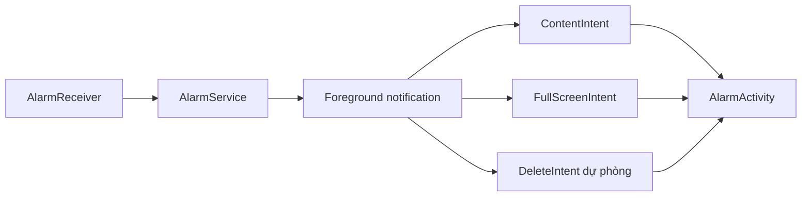
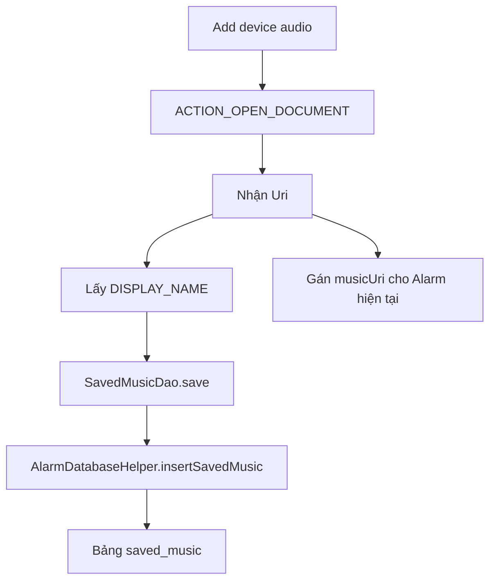
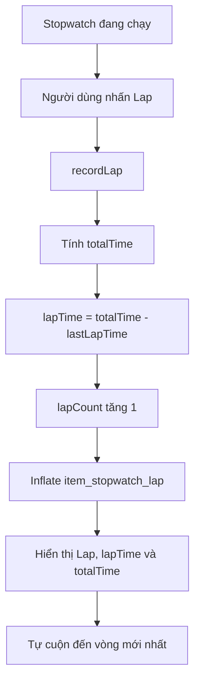
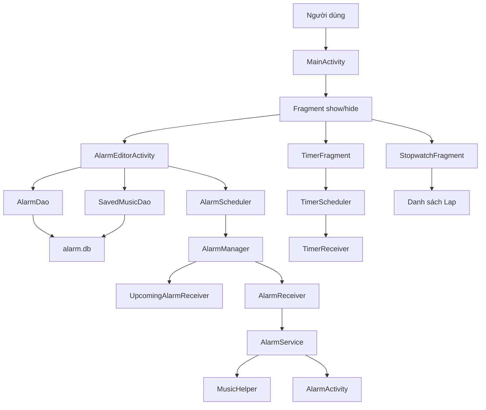

# Tổng hợp các thay đổi và chức năng được phục vụ

Tài liệu này ghi lại các thay đổi chính đã thực hiện trong ứng dụng Alarm, lý do sửa và chức năng mà từng thay đổi phục vụ.

---

# 1. Tổng quan nhanh

| Nhóm thay đổi | Vấn đề được giải quyết | Chức năng được phục vụ |
|---|---|---|
| Gradle/AGP | Android Studio không hỗ trợ AGP 9.3.0 | Build và chạy project ổn định |
| CRUD Alarm bằng Activity | Màn chỉnh sửa dạng Fragment cản trở chuyển tab | Thêm, sửa và xóa Alarm độc lập |
| Fragment `show/hide` | Timer/Stopwatch mất trạng thái khi đổi tab | Giữ bộ đếm đang chạy |
| Theme sáng/tối và portrait | Giao diện chưa đồng bộ với hệ thống | UI thích ứng light/dark và luôn hiển thị dọc |
| Bottom Navigation nổi | Navigation cũ chưa hiện đại | Điều hướng bốn chức năng |
| NumberPicker | Số vừa kéo bị nhỏ hoặc mất chữ đậm | Chọn giờ/phút/giây đồng nhất |
| Notification Alarm | Có thể mất đường vào màn tắt chuông | Mở `AlarmActivity`, hạn chế xóa notification |
| Notification trước một phút | Notification cũ còn tồn tại khi Alarm reo | Tự dọn notification nhắc trước |
| Thư viện nhạc URI | Alarm khác phải mở Device Picker lại | Dùng lại nhạc thiết bị đã chọn |
| Kiểm tra và fallback URI | File thiết bị bị xóa làm Alarm không phát nhạc | Xóa mục hỏng và phát cố định bài mặc định đầu tiên |
| Stopwatch Lap | Không ghi được thời gian từng vòng và tổng thời gian | Bảng Lap, Lap time, Overall time |

---

# 2. Điều chỉnh Gradle và Android Gradle Plugin

## Vấn đề

Project từng sử dụng:

```text
AGP 9.3.0
```

trong khi phiên bản Android Studio chỉ hỗ trợ tối đa AGP 8.13.0.

## Thay đổi

```text
gradle/libs.versions.toml
    -> AGP 8.13.0

gradle/wrapper/gradle-wrapper.properties
    -> Gradle 8.13
```

## Chức năng được phục vụ

- Cho phép Android Studio sync project.
- Cho phép Gradle compile Java và resource.
- Tạo APK debug.
- Chạy unit test và lint.

---

# 3. Chuyển CRUD Alarm thành Activity

## Vấn đề

Khi giao diện thêm/sửa Alarm nằm trong luồng Fragment, người dùng phải đóng màn chỉnh sửa trước khi chuyển sang tab khác.

## Thay đổi

Tách CRUD sang:

```text
AlarmEditorActivity
```

Fragment chỉ mở Activity và truyền ID:

```text
AlarmFragment.edit(id)
    -> Intent
    -> EXTRA_ALARM_ID
    -> AlarmEditorActivity
```

Quy ước:

```text
id = -1  -> thêm Alarm mới
id >= 0  -> sửa Alarm đã tồn tại
```

## Chức năng được phục vụ

- Thêm Alarm.
- Chỉnh sửa Alarm.
- Xóa Alarm.
- Chọn thời gian, ngày lặp, nhạc, âm lượng, rung và chế độ tắt.
- Màn chỉnh sửa có vòng đời độc lập với bốn tab chính.

---

# 4. Giữ Fragment bằng `show/hide`

## Vấn đề

Nếu dùng `replace()`, Fragment Timer hoặc Stopwatch có thể bị tạo lại khi chuyển tab, làm mất trạng thái đang chạy.

## Thay đổi

Trong `MainActivity.show(tag)`:

```text
Tìm các Fragment đã tồn tại
-> hide Fragment không được chọn
-> tìm Fragment theo tag
-> nếu chưa có thì add một lần
-> show Fragment được chọn
```

## Chức năng được phục vụ

- Timer tiếp tục đếm khi chuyển tab.
- Stopwatch tiếp tục chạy khi chuyển tab.
- World Clock biết lúc bị ẩn thông qua `onHiddenChanged()`.
- Không tạo Fragment mới không cần thiết.

---

# 5. Theme sáng/tối, gradient và khóa dọc

## Theme sáng

```text
Trắng khoảng 80% phía trên
-> mint sáng nhạt khoảng 20% phía dưới
```

Resource:

```text
res/drawable/bg_app_gradient.xml
res/values/colors.xml
res/values/themes.xml
```

## Theme tối

```text
Xanh đen khoảng 70% phía trên
-> tím nhạt phía dưới
```

Resource:

```text
res/drawable-night/bg_app_gradient.xml
res/values-night/colors.xml
res/values-night/themes.xml
```

Android tự chọn resource thường hoặc `-night` theo chế độ hệ thống.

## Khóa giao diện dọc

Các Activity được khai báo:

```xml
android:screenOrientation="portrait"
```

## Chức năng được phục vụ

- App tự đổi màu theo light/dark mode của Android.
- Chữ, card, nút và navigation có màu phù hợp từng theme.
- Giao diện không bị vỡ khi xoay ngang thiết bị.

---

# 6. Bottom Navigation nổi

## Thay đổi

`BottomNavigationView` được đặt trong `MaterialCardView`:

```text
Bo góc 30dp
Elevation 14dp
Margin hai bên và phía dưới
Màu nền riêng theo light/dark
Active indicator và icon tint
```

## Chức năng được phục vụ

Điều hướng giữa:

```text
Alarm
World Clock
Timer
Stopwatch
```

Giao diện navigation mang phong cách đồng hồ Samsung hiện đại và không dính sát cạnh màn hình.

---

# 7. Sửa font NumberPicker

## Vấn đề

Sau khi kéo một NumberPicker:

- Số vừa chọn có thể nhỏ hơn.
- Chữ không còn đậm.
- Giờ và phút hiển thị không đồng đều.

## Thay đổi

Tạo lớp dùng chung:

```text
Util/NumberPickerStyler.java
```

Áp dụng tại:

```text
AlarmEditorActivity -> giờ, phút
TimerFragment       -> giờ, phút, giây
```

Style:

```text
27sp
sans-serif bold
căn giữa
màu text_primary theo theme
```

Style được áp lại:

```text
Khi text thay đổi
Khi value thay đổi
Khi dừng cuộn
Ngay lập tức, sau 48ms và sau 120ms
```

## Chức năng được phục vụ

- Chọn thời gian Alarm.
- Chọn thời lượng Timer.
- Giữ font đồng đều sau khi kéo.

---

# 8. Notification Alarm đang reo

## Vấn đề
tôi và sửa đó phục vụ chức năng gì

1:21 PM

Worked for 3m 16s

Nếu notification Alarm biến mất, người dùng có thể không còn đường nhanh để vào màn Snooze/Dismiss trong khi Service vẫn phát nhạc.

## Thay đổi

Trong `AlarmService`:

```java
setContentIntent(fullScreenPendingIntent)
setDeleteIntent(fullScreenPendingIntent)
setFullScreenIntent(fullScreenPendingIntent, true)
setOngoing(true)
setAutoCancel(false)
```

Notification foreground sử dụng ID riêng:

```text
410000
```

## Flow



## Chức năng được phục vụ

- Chạm notification để mở `AlarmActivity`.
- Android có thể tự mở toàn màn hình khi Alarm reo.
- Notification không tự biến mất trong lúc Service đang chạy.
- Trên hệ thống vẫn cho xóa ongoing notification, thao tác xóa dẫn đến `AlarmActivity` để người dùng có thể tắt chuông.
- Khi Dismiss/Snooze dừng Service, notification foreground được xóa.

---

# 9. Xóa notification “Alarm in 1 minute”

## Vấn đề

Notification nhắc trước một phút vẫn có thể nằm trong thanh thông báo sau khi Alarm chính đã bắt đầu reo.

## Thay đổi

Notification nhắc trước dùng ID:

```text
200000 + alarmId
```

Khi Alarm chính đến giờ:

```text
AlarmReceiver.onReceive()
    -> NotificationManager.cancel(200000 + alarmId)
    -> khởi động AlarmService
```

Khi người dùng tắt hoặc xóa Alarm:

```text
AlarmScheduler.cancel()
    -> hủy PendingIntent reminder
    -> xóa notification reminder đã hiển thị
```

Code cũng xóa notification dùng ID cũ để tương thích dữ liệu từ bản app trước.

## Chức năng được phục vụ

- Thanh thông báo không còn nội dung “Alarm in 1 minute” khi Alarm đã reo.
- Tắt/xóa Alarm sẽ dọn cả lịch và notification liên quan.
- Notification Alarm chính không bị trùng ID với reminder.

---

# 10. Lưu URI nhạc vào Alarm

## Thay đổi

Khi chọn Device Audio:

```text
ACTION_OPEN_DOCUMENT
-> nhận Uri
-> takePersistableUriPermission()
-> alarm.setMusicUri(uri.toString())
```

Nếu đang sửa Alarm có ID:

```text
AlarmDao.updateAlarm()
-> cột music_uri trong bảng alarms
```

Nếu đang tạo Alarm mới, URI được giữ trong Model và insert cùng Alarm khi bấm Save.

## Chức năng được phục vụ

- Mỗi Alarm có thể giữ một nhạc thiết bị riêng.
- Quyền đọc URI được giữ qua các lần mở app.
- Không tạo dòng Alarm rác nếu người dùng chọn nhạc rồi đóng màn hình tạo mới.

---

# 11. Thư viện nhạc URI dùng chung

## Vấn đề

Alarm 1 đã chọn một file từ thiết bị, nhưng Alarm 2 vẫn phải mở Device Picker để tìm lại cùng file.

## Thay đổi database

Không tạo file database mới. Tăng version của:

```text
alarm.db: version 2 -> version 3
```

Thêm bảng:

```sql
saved_music (
    _id INTEGER PRIMARY KEY AUTOINCREMENT,
    name TEXT NOT NULL,
    uri TEXT NOT NULL UNIQUE,
    added_at INTEGER NOT NULL
)
```

Các lớp mới:

```text
Model/SavedMusic.java
DAO/SavedMusicDao.java
```

Các URI cũ trong bảng `alarms` được migration vào `saved_music` khi database nâng lên version 3.

## Flow thêm nhạc



## Flow dùng lại

```text
Alarm 2 mở hộp thoại Sound
-> 5 bài res/raw
-> SavedMusicDao.getAll()
-> ghép thành một danh sách
-> chọn lại bài đã lưu
-> không cần mở Device Picker
```

## Chức năng được phục vụ

- Một URI chỉ lưu một lần nhờ ràng buộc `UNIQUE`.
- Hiển thị tên file nhạc.
- Nghe thử bài URI đã lưu.
- Dùng lại cùng bài cho nhiều Alarm.
- Bài mới thêm được đưa lên đầu danh sách theo `added_at`.

---

# 12. Kiểm tra, xóa và fallback khi URI không còn truy cập được

## Vấn đề

URI có thể không sử dụng được nếu:

- Người dùng xóa file.
- File bị di chuyển.
- Ứng dụng cung cấp file thu hồi quyền.
- File không còn mở được qua `ContentResolver`.

## Thay đổi

Khi người dùng chọn lại một bài trong thư viện nhạc:

```text
AlarmEditorActivity.sounds()
-> MusicUriHelper.isReadable()
-> không đọc được:
   -> hiện Toast báo không tìm thấy bài
   -> SavedMusicDao.deleteAndResetAlarms()
   -> xóa URI khỏi saved_music
   -> đưa các Alarm đang dùng URI đó về musicId = 0, musicUri = null
```

`MusicUriHelper` dùng `ContentResolver.openFileDescriptor()` để kiểm tra trực tiếp khả năng mở file, không dùng `InputStream.available()`.

Khi Alarm đến giờ:

```text
AlarmService
-> MusicUriHelper.isReadable()
-> URI đọc được: MusicHelper.playFromUri()
-> URI mất hoặc MediaPlayer không phát được: MusicHelper.playDefault()
-> phát cố định R.raw.alarm1 (Aurora)
```

## Chức năng được phục vụ

- Danh sách nhạc tự dọn bài đã bị xóa khỏi thiết bị.
- Mọi Alarm tham chiếu bài bị mất được đưa về Aurora trong database.
- Alarm không bị im lặng chỉ vì file thiết bị mất.
- `R.raw.alarm1` luôn là phương án dự phòng xác định, không chọn ngẫu nhiên.

---

# 13. Thêm Lap cho Stopwatch

## Thay đổi giao diện

Thêm nút:

```text
Reset | Lap | Start/Pause
```

Thêm khu vực danh sách phía dưới:

```text
Lap       Lap time       Overall time
Lap 1     00:10.00       00:10.00
Lap 2     00:15.50       00:25.50
Lap 3     00:12.25       00:37.75
```

Resource:

```text
fragment_stopwatch.xml
item_stopwatch_lap.xml
```

## Logic

Các biến mới:

| Biến | Ý nghĩa |
|---|---|
| `lapCount` | Số thứ tự vòng |
| `lastLapTime` | Tổng thời gian tại lần bấm Lap trước |
| `lapList` | Layout chứa các item vòng |

Khi bấm Lap:

```java
totalTime = timeSwapBuff + (uptimeMillis() - startTime);
lapTime = totalTime - lastLapTime;
lastLapTime = totalTime;
lapCount++;
```

## Flow



## Quy tắc

- Nút Lap chỉ bật khi Stopwatch đang chạy.
- Pause sẽ tắt nút Lap.
- Thời gian Pause không được tính vào vòng tiếp theo.
- Resume tiếp tục tính từ phần thời gian đã tích lũy.
- Reset dừng Stopwatch, đưa thời gian về 0 và xóa toàn bộ Lap.

## Chức năng được phục vụ

- Ghi thời gian từng vòng chạy.
- So sánh thời gian riêng của vòng với tổng thời gian từ lúc Start.
- Theo dõi Lap 1, Lap 2, Lap 3…
- Hiển thị danh sách cuộn có header `Lap`, `Lap time`, `Overall time`.

---

# 14. Tài liệu flow đã bổ sung

Các tài liệu liên quan:

```text
THUYET_TRINH_LUONG_CHAY.md
README_TIMER_ALARM_FLOW.md
TONG_HOP_CAC_THAY_DOI.md
```

Nội dung gồm:

- Vai trò của Activity, Fragment, Adapter, DAO, Model.
- Database, Util, Receiver và Service.
- Flow Alarm, Timer, Stopwatch và World Clock.
- Notification và phát nhạc.
- Các thay đổi chức năng được thực hiện.

---

# 15. Kết quả kiểm tra

Các lệnh đã chạy:

```text
:app:assembleDebug
:app:testDebugUnitTest
:app:lintDebug
```

Kết quả:

```text
BUILD SUCCESSFUL
```

Smoke test trên emulator API 36.1:

```text
MainActivity                    -> mở thành công
Stopwatch Start/Pause           -> hoạt động
Stopwatch Lap 1/Lap 2           -> hiển thị đúng
AlarmEditorActivity             -> mở thành công
Dialog chọn nhạc                -> mở thành công
Logcat FATAL EXCEPTION          -> không có
Logcat assetStream/InputStream  -> không có
```

Máy test chưa cài AVD API 28. Lỗi `assetStream is null` quan sát trong Layout Preview API 28 được đánh giá là lỗi renderer của Android Studio; nó không xuất hiện trong runtime test của APK.

---

# 16. Flow tổng hợp sau các thay đổi



Tóm tắt:

> Giao diện nhận thao tác; Model giữ dữ liệu; DAO và Database lưu dữ liệu; Scheduler giao lịch cho Android; Receiver nhận sự kiện; Service xử lý nhạc/rung; Activity cung cấp màn hình điều khiển; Fragment giữ trạng thái Timer, Stopwatch và danh sách Lap.
